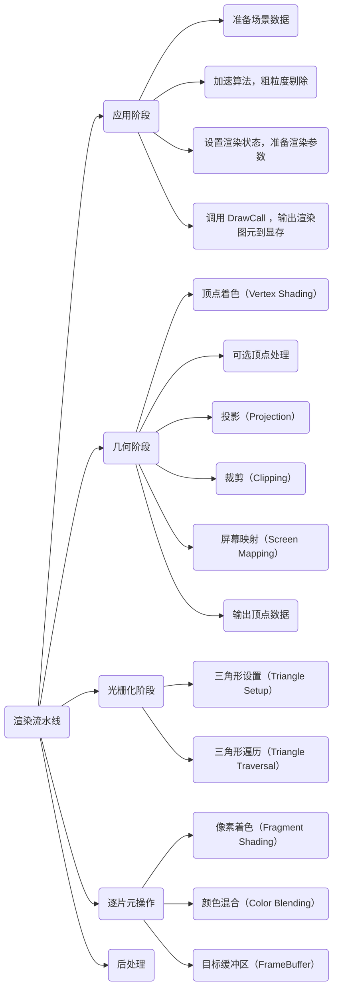

Unity Shader 入门精要部分笔记记得比较详细，这里的笔记就简单记一下重点部分，就当复习一下。

# 1. 渲染流水线

整体流程：应用阶段 -> 几何阶段 -> 光栅化阶段 -> 逐片元操作 -> 后处理

1. **应用阶段**：粗粒度剔除，进行渲染设置，准备基本数据，输出到几何阶段
    1. 准备场景数据
    2. 加速算法，粗粒度剔除
    3. 设置渲染状态，准备渲染参数
    4. 调用 DrawCall ，输出渲染图元到显存
2. **几何阶段**：顶点着色器，曲面细分，几何着色器，顶点裁剪，屏幕映射
    1. 顶点着色（Vertex Shading）
    2. 可选顶点处理
    3. 投影（Projection）
    4. 裁剪（Clipping）
    5. 屏幕映射（Screen Mapping）
    6. 输出顶点数据
3. **光栅化阶段**：三角形（点/线）设置，三角形（点/线）遍历，片段着色器
    1. 三角形设置（Triangle Setup）
    2. 三角形遍历（Triangle Traversal）
4. **逐片元操作**：裁剪测试、透明度测试、深度测试、模板测试，混合
    1. 像素着色（Fragment Shading）
    2. 颜色混合（Color Blending）
    3. 目标缓冲区（FrameBuffer）
5. **后处理**

