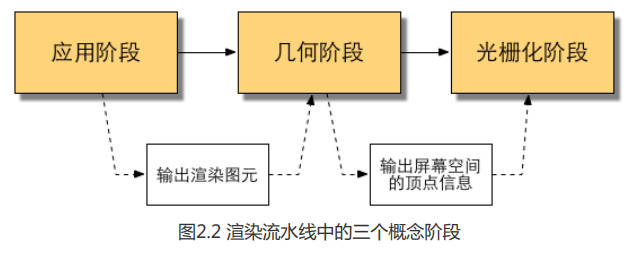

# 1. 欢迎来到Shader的世界

我们之所以会觉得学习Shader比学习C#这样的编程语言更加困难，一个原因是因为Shader需要牵扯到整个渲染流程。

当学习C、C#这样的高级语言时，我们可以在不了解计算机架构的情况下仍然编写出实现各种功能的代码，这样的高级语言更符合人类的思维方式。

然而，Shader并不是这样的。我们之所以要学习Shader，是想要学习如何把物体按照自己的意愿渲染到屏幕上，但是，Shader只是整个渲染流程中的一个子部分。虽然它很关键，但想要学习它，我们就需要了解整个渲染流程是如何进行的。和C这样的高级语言不同，尽管Shader的编写语言已经达到了我们可以理解的程度，但Shader更多地是面向GPU的工作方式，所以它的一些语法对我们来说并不那么直观。

# 2. 渲染流水线

Shader 即着色器，与之关系非常紧密的就是渲染流水线。可以说如果你没有了解过渲染流水线的工作流程，就永远无法说自己对Shader已经入门。

**渲染流水线最终目的在于生成或者说是渲染一张二维纹理，即我们在电脑屏幕上看到的所有效果**。它的输入是一个虚拟摄像机、一些光源、一些Shader已经纹理等。

## 2.1 综述

要学会Shader我们首先要了解Shader是如何工作的。实际上，**Shader仅仅是渲染流水线中的一个环节**，想要让我们的Shader发挥出它的作用，我们就需要知道它在渲染流水线中扮演了怎样的角色。

### 2.1.1 什么是流水线

理想情况下，如果把一个非流水线系统分成n个流水线阶段，且每个阶段耗费时间相同的话，会使整个系统得到n倍的速度提升。

*   使用流水线的好处在于可以提高单位时间的生产量。
*   流水线系统中决定最后生产速度的是最慢的工序所需的时间。（例如：如果生产洋娃娃的第二道工序需要的时间是两小时其他工序是一小时的话，那么平均两小时才能生产出一个洋娃娃。即工序2是性能的瓶颈）

### 2.1.2 什么是渲染流水线

渲染流水线的工作任务在于**由一个三维场景出发、生成（或者说渲染）一张二维图像**。换句话说，计算机需要从一系列的顶点数据、纹理等信息出发，把这些信息最终转换成一张人眼可以看到的图像。而这个工作通常是由CPU和GPU共同完成的。

《Real-Time Rendering, Third Edition》一书中将一个渲染流程分为3个阶段：

*   应用阶段（Application Stage）
*   几何阶段（Geometry Stage）
*   光栅化阶段（Rasterizer Stage）

每个阶段本身通常也是一个流水线系统，即包含了子流水线阶段。三个概念阶段之间的联系：



#### 应用阶段

这个阶段由我们的应用主导的，因此通常由CPU负责实现。换句话说我们这些开发者具有这个阶段的绝对控制权。

这个阶段中，开发者有3个主要任务：

*   准备场景数据（相机位置、视锥体、场景模型、光源等）
*   为了提高渲染性能，需要做粗粒度剔除（culling），把不可见的物体剔除出去
*   设置每个模型的渲染状态（材质、纹理、Shader等）

这一阶段最重要的输出是渲染所需的几何信息，即**渲染图元（rendering primitives）**。
通俗来讲，渲染图元可以是点、线、三角面等。这些渲染图元会被传递给下一阶段——几何阶段。

#### 几何阶段

几何阶段用于处理所有和我们要绘制的几何相关的事情。这一阶段通常在GPU上进行。
* 几何阶段负责和每个渲染图元打交道，进行逐顶点、逐多边形的操作。
* 几何阶段的一个重要任务就是把顶点坐标变换到屏幕空间中，再交给光栅器进行处理。

输出屏幕空间的二维顶点坐标、每个顶点对应的深度值、着色等相关信息，并传递给下一阶段。

#### 光栅化阶段
这个阶段会使用上个阶段传递的数据来产生屏幕上的像素，并渲染出最终图像，这一阶段也是在GPU上运行。
* 光栅化的任务主要是决定每个渲染图元中的哪些像素应该被绘制在屏幕上
* 它需要对上一个阶段得到的逐顶点数据（例如纹理坐标、顶点颜色等）进行插值，然后再进行逐像素处理。

## 2.2 CPU和GPU之间的通信
渲染流水线的起点是CPU，即应用阶段。应用阶段大致可分为下面3个阶段：
1. 把数据加载到显存中。
2. 设置渲染状态。
3. 调用Draw Call。

### 2.2.1 把数据加载到显存中
* 所有渲染所需的数据都需要从硬盘(Hard Disk Drive, HDD)中加载到系统内存(Random Access Memory, RAM)中。
* 网格和纹理等数据又被加载到显卡上的存储空间——显存(Video Random Access Memory, VRAM)中。这是因为，显卡对于显存的访问速度更快，而且大多数显 卡对于RAM没有直接的访问权利。

图2.3所示给出了这样一个例子。


当把数据加载到显存中后，RAM中的数据就可以移除了。但对于一些数据来说，CPU仍然需要访问它们（例如：我们希望CPU可以访问网格数据来进行碰撞检测），那么我们可能就不希望这些数据被移除，因为从硬盘加载到RAM的过程是十分耗时的。
在这之后，开发者还需要通过CPU来设置渲染状态，从而“指导”GPU如何进行渲染工作。

### 2.2.2 设置渲染状态
什么是渲染状态呢？一个通俗的解释就是，这些状态定义了场景中的网格是怎样被渲染的。
例如：使用哪个顶点着色器（Vertex Shader）/片元着色器（Fragment Shader）、光源属性、材质等。


图2.4 在同一状态下渲染三个网格。由于没有更改渲染状态，因此三个网格的外观看起来像是同一种材质的物体。

准备好上述所有工作后，**CPU就需要调用一个渲染命令来告诉GPU**：“嘿！老兄，我都帮你把数据准备好啦，你可以按照我的设置来开始渲染啦！”而这个渲染命令就是**Draw Call**。

### 2.2.3 调用Draw Call
Draw Call就是一个命令，它的发起方是CPU，接收方是GPU。
* 这个命令仅仅会指向一个需要被渲染的图元（primitives）列表，而不会再包含任何材质信息——这是因为我们已经再上一个阶段中完成了。
* 当给定了一个Draw Call时，GPU就会根据渲染状态（例如材质、纹理、着色器等）和所有输入的顶点数据来进行计算，最终输出成屏幕上显示的那些漂亮的像素。而这个计算过程就是**GPU流水线**。


## 2.3 GPU 流水线
当GPU从CPU那里得到渲染命令后，就会进行一系列流水线操作，最终把图元渲染到屏幕上。

### 2.3.1 概述
CPU 通过调用 Draw Call 来命令 GPU 进行渲染，GPU 渲染的过程就是 GPU 流水线。

对于概念阶段的后两个阶段，即渲染阶段和光栅化阶段，开发者无法拥有绝对的控制权，其实现的载体是GPU。GPU通过实现流水线化，大大加快了渲染速度。虽然我们无法控制这两个阶段的实现细节，但GPU向开发者开放了很多控制权。

几何阶段和光栅化阶段可以分成若干更小的流水线阶段，这些流水线阶段由GUP来实现，每个阶段GPU提供了不同的可配置性或可编程性。图2.6中展示了不同的流水线阶段以及它们的可配置性或可编程性。


从图中可以看出，GPU的渲染流水线接收顶点数据作为输入。这些顶点数据是由应用阶段加载到显存中，再由Draw Call指定的。这些数据随后被传递给顶点着色器。
* **顶点着色器（Vertex Shader）** 是完全可编程的，它通常用于实现顶点的空间变换、顶点着色等功能。
* **曲面细分着色器（Tessellation Shader）** 是可选的着色器，它用于细分图元。
* **几何着色器（Geometry Shader）** 是可选的着色器，它可以被用于执行逐图元（Per-Primitive）的着色操作，或者被用于产生更多的图元。
* **裁剪（Clipping）** 将那些不在摄像机视野内的顶点裁剪掉，并剔除某些三角图元的面片。这个阶段是可配置的。
* **屏幕映射（Screen Mapping）** 是不可配置和编程的，它负责把每个图元的坐标转换到屏幕坐标系中。

光栅化概念阶段：
* **三角形设置（Triangle Setup）** 和 **三角形遍历（Triangle Traversal）** 阶段也都是固定函数（Fixed-Function）的阶段
* **片元着色器（Fragment Shader）** 是完全可编程的，它用于实现逐片元（Per-Fragment）的着色操作。
* **逐片元操作（Per-Fragment）** 负责执行很多重要的操作，例如修改颜色、深度缓冲、进行混合等，它是不可编程的，但具有很高的可配置性。

### 2.3.2 顶点着色器
**顶点着色器（Vertex Shader）** 是流水线的第一个阶段，它的输入来自于CPU。顶点着色器处理单位是顶点，也就是说，输入进来的每个顶点都会调用一次顶点着色器，顶点与顶点之间是相互独立的。

顶点着色器需要完成的工作主要有：坐标变换和逐顶点光照。当然，除了这两个主要任务外，顶点着色器还可以输出后续阶段所需的数据。图2.7展示了再顶点着色器中对顶点位置精选坐标变换并计算顶点颜色的过程。


* 坐标变换，顾名思义就是对顶点的坐标（即位置）进行某种变换。一个最基本的顶点着色器必须完成的工作是，**把顶点坐标从模型空间转换到其次裁剪空间**。（我们可以通过改变顶点位置来模拟水面、布料等。）
```
o.pos = mul(UNITY_MVP, v.position);
```


### 2.3.3 裁剪
将那些不在摄像机视野内的顶点裁剪掉，并剔除某些三角图元的面片。这一步是不可编程的，但可以自定义一个裁剪操作来对这一步进行配置。

一个图元和摄像机视野的关系有3种:完全在视野内、部分在视野内、完全在视野外。
* 完全在视野内的图元就继续传递给下一个流水线阶段
* 完全在视野外的图元不会继续向下传递，因为它们不需要被渲染。
* 部分在视野内的图元需要进行一个处理，这就是裁剪。

由于我们已知在NDC下的顶点位置，即顶点位置在一个立方体内，因此裁剪就变得很简单:只需要将图元裁剪到单位立方体内。图2.9展示了这样的一个过程。


### 2.3.4 屏幕映射
这一步输入的坐标仍然是三维坐标系下的坐标（范围在单位立方体内)。
* **屏幕映射(Screen Mapping）** 的任务是把每个图元的x和y坐标转换到**屏幕坐标系(Screen Coordinates)** 下。
* 屏幕坐标系是一个二维坐标系，它和我们用于显示画面的分辨率有很大关系。

假设，我们需要把场景渲染到一个窗口上，窗口的范围是从最小的窗口坐标 (x1,y1) 到最大的窗口坐标 (x2 ,y2)，其中 x1 < x2 且 y1 < y2。由于我们输入的坐标范围在-1到1，因此可以想象到，这个过程实际是一个缩放的过程，如图2.10所示。
你可能会问，那么输入的z坐标会怎么样呢?屏幕映射不会对输入的z坐标做任何处理。实际上，屏幕坐标系和z坐标一起构成了一个坐标系，叫做**窗口坐标系（Window Coordinates)**。这些值会一起被传递到光栅化阶段。


屏幕映射得到的屏幕坐标决定了这个顶点对应屏幕上哪个像素以及距离这个像素有多远。

有一个需要引起注意的地方是，屏幕坐标系在OpenGL 和 DirectX之间的差异问题：
* OpenGL把屏幕的左下角当成最小的窗口坐标值，而 DirectX则定义了屏幕的左上角为最小的窗口坐标值。图2.11显示了这样的差异。


### 2.3.5 三角形设置
由这一步开始就进入了光栅化阶段。从上一个阶段输出的信息是屏幕坐标系下的顶点位置以及和它们相关的额外信息，如深度值(z坐标)、法线方向、视角方向等。光栅化阶段有两个最重要的目标:计算每个图元覆盖了哪些像素，以及为这些像素计算它们的颜色。

光栅化的第一个流水线阶段是**三角形设置(Triangle Setup)**。这个阶段会计算光栅化一个三角网格所需的信息。

具体来说，上一个阶段输出的都是三角网格的顶点，即我们得到的是三角网格每条边的两个端点。但如果要得到整个三角网格对像素的覆盖情况，我们就必须计算每条边上的像素坐标。为了能够计算边界像素的坐标信息，我们就需要得到三角形边界的表示方式。这样一个计算三角网格表示数据的过程就叫做三角形设置。它的输出是为了给下一个阶段做准备。

### 2.3.6 三角形遍历
**三角形遍历（Triangle Traversal）** 阶段将会检查每个像素是否被一个三角网格所覆盖。如果被覆盖的话,就会生成一个**片元（fragment）**。而这样一个找到哪些像素被三角网格覆盖的过程就是三角形遍历，这个阶段也被称为**扫描变换（Scan Conversion）**。
三角形遍历阶段会根据上一个阶段的计算结果来判断一个三角网格覆盖了哪些像素，并使用三角网格3个顶点的顶点信息对整个覆盖区域的像素进行插值。图2.12展示了三角形遍历阶段的简化计算过程。


这一步的输出就是得到一个片元序列。

### 2.3.7 片元着色器
**片元着色器（Fragment Shader）** 是另一个非常重要的可编程着色器阶段。在DirectX中，片元着色器被称为**像素着色器（Pixel Shader）**，但片元着色器是一个更合适的名字，因为此时的片元并不是一个真正意义上的像素。

* 光栅化阶段实际上并不会影响屏幕上每个像素的颜色值，而是会产生一系列的数据信息，用来表述一个三角网格是怎样覆盖每个像素的。
* 而每个片元就负责存储这样一系列数据。真正会对像素产生影响的阶段是下一个流水线阶段——**逐片元操作（Per-Fragment Operations）**。我们随后就会讲到。

片元着色器的输入是上一个阶段对顶点信息插值得到的结果。
更具体来说，是根据那些从顶点着色器中输出的数据插值得到的。而它的输出是一个或者多个颜色值。图2.13显示了这样一个过程。


这一阶段可以完成很多重要的渲染技术，其中最重要的技术之一就是**纹理采样**。为了在片元着色器进行纹理采样，我们会在顶点着色器阶段输出每个顶点对应的纹理坐标，经过插值之后就能得到其覆盖的每个片元的纹理坐标了。

虽然片元着色器很重要，但其局限性在于仅能影响单个片元。也就是说当执行片元着色器时，它不可以将自己的任何结果直接发送给它的邻居（相邻的其他片元）。除了当片元着色器可以访问到导数信息（gradient或者说derivative）时例外（本章拓展阅读部分补充）。

### 2.3.8 逐片元操作
渲染流水线的最后一步是**逐片元操作（Per-Fragment Operations）**，在DirectX中称为**输出合并阶段（Output-Merger）**。最主要的目的还是Merge合并，合并的目标就是每一个片元。

这一阶段有几个主要任务：
1. 决定每个片元的可见性。这涉及很多测试工作，例如深度测试、模板测试等。
2. 如果一个片元通过了所有的测试，就需要把这个片元的颜色值和已经存储在颜色缓冲区中的颜色进行合并，或者说是混合。

逐片元操作阶段是高度可配置性的，即我们可以设置每一步的操作细节。

这个阶段首先需要解决每个片元的可见性问题。这需要进行一系列测试。如果他没有通过其中的某一个测试，那么这个片元会被舍弃掉。


测试的过程实际上是个比较复杂的过程，这里给出两个最基本的测试——**深度测试和模板测试**的实现过程。


我们先来看**模板测试（Stencil Test）**。与之相关的是模板缓冲（Stencil Buffer）。

* 如果开启了模板测试，GPU会首先读取模板缓冲区中该片元位置的模板值，然后将该值和读取（使用读取掩码）到的参考值（reference value）进行比较，这个比较函数可以是由开发者指定的，例如小于时舍弃该片元，或者大于等于时舍弃该片元。如果这个片元没有通过这个测试，该片元就会被舍弃。

如果通过了模板测试，那么它会进行下一个测试——**深度测试（Depth Test）**。

* 这个测试同样是可以高度配置的。如果开启了深度测试，GPU会把该片元的深度值和已经存在于深度缓冲区中的深度值进行比较。这个比较函数也是可由开发者设置的，例如小于时舍弃该片元，或者大于等于时舍弃该片元。

* 通常这个比较函数是小于等于的关系，即如果这个片元的深度值大于等于当前深度缓冲区中的值，那么就会舍弃它。这是因为，我们总想只显示出离摄像机最近的物体，而那些被其他物体遮挡的就不需要出现在屏幕上。如果这个片元没有通过这个测试，该片元就会被舍弃。

如果一个片元通过了上面的所有测试，它就会来到**合并**功能的面前。

* 为什么需要合并?当我们执行这次渲染时，颜色缓冲中往往已经有了上次渲染之后的颜色结果，那么，我们是使用这次渲染得到的颜色完全覆盖掉之前的结果，还是进行其他处理?这就是合并需要解决的问题。

* 对于不透明物体，开发者可以关闭**混合（Blend）** 操作。这样片元着色器计算得到的颜色值就会直接覆盖掉颜色缓冲区中的像素值。但对于半透明物体，我们就需要使用混合操作来让这个物体看起来是透明的。图2.16展示了一个简化版的混合操作的流程图。


从流程图中我们可以发现，混合操作也是可以高度配置的:开发者可以选择开启/关闭混合功能。
* 如果没有开启混合功能，就会直接使用片元的颜色覆盖掉颜色缓冲区中的颜色，而这也是很多初学者发现无法得到透明效果的原因（没有开启混合功能)。
* 如果开启了混合，GPU会取出源颜色和目标颜色，将两种颜色进行混合。源颜色指的是片元着色器得到的颜色值，而目标颜色则是已经存在于颜色缓冲区中的颜色值。
* 之后，就会使用一个混合函数来进行混合操作。这个混合函数通常和透明通道息息相关，例如根据透明通道的值进行相加、相减、相乘等。混合很像Photoshop中对图层的操作:每一层图层可以选择混合模式，混合模式决定了该图层和下层图层的混合结果，而我们看到的图片就是混合后的图片。

上面给出的测试顺序并不是唯一的，而且虽然从逻辑上来说这些测试是在片元着色器之后进行的，但对于大多数GPU来说，它们会尽可能在执行片元着色器之前就进行这些测试。这是可以理解的，想象一下，当GPU在片元着色器阶段花了很大力气终于计算出片元的颜色后，却发现这个片元根本没有通过这些检验，也就是说这个片元还是被舍弃了，那之前花费的计算成本全都浪费了!图2.17给出了这样一个场景。


作为一个想充分提高性能的GPU,它会希望尽可能早地知道哪些片元是会被舍弃的,对于这些片元就不需要再使用片元着色器来计算它们的颜色。

在Unity给出的渲染流水线中，我们也可以发现它给出的深度测试是在片元着色器之前。这种将深度测试提前执行的技术通常也被称为Early-Z技术。

但是，如果将这些测试提前的话，其检验结果可能会与片元着色器中的一些操作冲突。例如，如果我们在片元着色器进行了透明度测试(我们将在8.3节中具体讲到)，而这个片元没有通过透明度测试,我们会在着色器中调用API（例如 clip函数）来手动将其舍弃掉。这就导致GPU无法提前执行各种测试。
因此，现代的GPU会判断片元着色器中的操作是否和提前测试发生冲突，如果有冲突，就会禁用提前测试。但是，这样也会造成性能上的下降，因为有更多片元需要被处理了。这也是透明度测试会导致性能下降的原因。

当模型的图元经过了上面层层计算和测试后，就会显示到我们的屏幕上。我们的屏幕显示的就是颜色缓冲区中的颜色值。
> 为了避免我们看到那些正在进行光栅化的图元，GPU会使用**双重缓冲（Double Buffering）** 的策略。这意味着，对场景的渲染是在幕后发生的，即在**后置缓冲(Back Buffer）** 中。一旦场景已经被渲染到了后置缓冲中，GPU就会交换后置缓冲区和**前置缓冲(Front Buffer）** 中的内容，而前置缓冲区是之前显示在屏幕上的图像。由此，保证了我们看到的图像总是连续的。

### 2.3.9 总结
虽然我们上面讲了很多，但其真正的实现过程远比上面讲到的要复杂。需要注意的是，读者可能会发现这里给出的流水线名称、顺序可能和在一些资料上看到的不同。一个原因是由于图像编程接口（如 OpenGL 和 DirectX)的实现不尽相同，另一个原因是GPU在底层可能做了很多优化，例如上面提到的会在片元着色器之前就进行深度测试，似避免无谓的计算。

虽然渲染流水线比较复杂，但 Unity 作为一个非常出色的平台为我们封装了很多功能。更多时候，我们只需要在一个 Unity Shader设置一些输入、编写顶点着色器和片元着色器、设置一些状态就可以达到大部分常见的屏幕效果。这是 Unity 吸引人的魅力之处，但这样的缺点在于，封装性会导致编程自由度下降，使很多初学者迷失方向，无法掌握其背后的原理，并在出现问题时，往往无法找到错误原因，这是在学习Unity Shader时普遍的遭遇。

渲染流水线几乎和本书所有章节都息息相关，如果读者此时仍然无法完全理解渲染流水线,仍可以继续学习下去。但如果读者在学习过程中发现有些设置或代码无法理解，可以不断查阅本章内容，相信会有更深的理解。

## 2.4 一些容易困惑的地方
在读者学习Shader的过程中，会看到一些所谓的专业术语，这些术语的出现频率很高，以至于如果没有对其有基本的认识，会使得初学者总是感到非常困惑。本章的最后将阐述其中的一些术语。

### 2.4.1 什么是OpenGL/DirectX
OpenGL和DirectX是图像应用编程接口，在硬件的基础上实现了一层抽象。这些接口用于渲染二维或三维图形。

一个应用程序向这些接口发送渲染命令，而这些接口会依次向显卡驱动（Graphics Driver）发送渲染命令，这些显卡驱动是真正知道如何和GPU通信的角色，正是它们把OpenGL或者DirectX的函数调用翻译成了GPU能够听懂的语言，同时它们也负责把纹理等数据转换成GPU所支持的格式。

概括来说，我们的应用程序运行在CPU上。应用程序可以通过调用OpenGL 或 DirectX的图形接口将渲染所需的数据，如顶点数据、纹理数据、材质参数等数据存储在显存中的特定区域。随后，开发者可以通过图像编程接口发出渲染命令，这些渲染命令也被称为Draw Call,它们将会被显卡驱动翻译成 GPU能够理解的代码，进行真正的绘制。


### 2.4.2 什么是HLSL、GLSL、Cg
着色语言是专门用于编写着色器的，常见的着色语言有
* DirectX的HLSL（High Level Shading Language）
* OpenGL的GLSL（OpenGL Shading Language）
* NVIDIA的CG（C for Graphic）。

HLSL、GLSL、CG都是“高级（High-Level）”语言，但这种高级是相对于汇编语言来说的，而不是像C#相对于C的高级那样。这些语言会被编译成与机器无关的汇编语言，也被称为中间语言（Intermediate Language, IL）。这些中间语言再交给显卡驱动来翻译成真正的机器语言，即GPU可以理解的语言。

* GLSL的优点在于它的跨平台性，只要显卡驱动支持对GLSL的编译它就可以运行。GLSL是依赖硬件，而非操作系统层级的。这也就意味着GLSL的编译结果将取决于硬件供应商，但世界上有很多硬件供应商，这可能会造成编译结果不一致的情况。

* HLSL是由微软控制着色器的编译，就算使用了不同的硬件，同一个着色器的编译结果也是一样的（前提是版本相同）。但也因此支持HLSL的平台相对比较有限，几乎完全是微软自己的产品。

* CG则是真正意义上的跨平台。它会根据平台的不同，编译成相应的中间语言。CG 语言的跨平台性很大原因取决于与微软的合作，这也导致 CG 语言的语法和 HLSL 非常相像，CG 语言可以无缝移植成HLSL 代码。但缺点是可能无法完全发挥出 OpenGL的最新特性。

对于Unity 平台，我们同样可以选择使用哪种语言。在Unity Shader 中，我们可以选择使用“CG/HLSL”或者“GLSL"。带引号是因为Unity里的这些着色语言并不是真正意义上的对应的着色语言，尽管它们的语法几乎一样。以 Unity CG为例，你有时会发现有些CG语法在Unity Shader中是不支持的。

### 2.4.3 什么是Draw Call
Draw Call本身的含义很简单,就是CPU调用图像编程接口，如 OpenGL 中的 gIDrawElements 命令或者 DirectX 中的 DrawIndexedPrimitive 命令，以命令 GPU 进行渲染的操作。

#### 问题一：CPU 和 GPU 是如何实现并行工作的？
使用**命令缓冲区（Command Buffer）**。

命令缓冲区包含了一个命令队列，由CPU向其中添加命令，而由 GPU从中读取命令，添加和读取的过程是互相独立的。命令缓冲区使得CPU和GPU可以相互独立工作。当CPU需要渲染一些对象时，它可以向命令缓冲区中添加命令，而当GPU完成了上一次的渲染任务后，它就可以从命令队列中再取出一个命令并执行它。

命令缓冲区中的命令有很多种类，而 Draw Call 是其中一种，其他命令还有改变渲染状态等(例如改变使用的着色器，使用不同的纹理等)。图2.19显示了这样一个例子。


#### 问题二：为什么 Draw Call 多了会影响帧率？
**在每次调用DrawCall 之前，CPU需要向GPU发送很多内容，包括数据、状态和命令等**。在这一阶段，CPU需要完成很多工作，例如检查渲染状态等。而一旦CPU完成了这些准备工作，GPU就可以开始本次的渲染。GPU的渲染能力是很强的，渲染200个还是2000个三角网格通常没有什么区别，因此渲染速度往往快于 CPU 提交命令的速度。如果 Draw Call 的数量太多 CPU 就会把大量时间花费在提交Draw Call 上，造成CPU的过载。图2.20显示了这样一个例子。


#### 问题三：如何减少 Draw Call ？
减少Draw Call的方法有很多，我们这里仅讨论**批处理（Batching）** 的方法。

批处理的想法就是把很多小的 Draw Call 合并成一个大的 Draw Call。

需要注意的是，由于我们需要在CPU的内存中合并网格，而合并的过程是需要消耗时间的。因此，批处理技术更加适合于那些静态的物体，例如不会移动的大地、石头等，对于这些静态物体我们只需要合并一次即可。当然，我们也可以对动态物体进行批处理。但是，由于这些物体是不断运动的，因此每一帧都需要重新进行合并然后再发送给GPU，这对空间和时间都会造成一定的影响。

在游戏开发过程中，为了减少Draw Call的开销，有两点需要注意:
1. 避免使用大量很小的网格。当不可避免地需要使用很小的网格结构时，考虑是否可以合并它们。
2. 避免使用过多的材质。尽量在不同的网格之间共用同一个材质。

### 2.4.4 什么是固定管线渲染
**固定函数的流水线(Fixed-Function Pipeline)**，也简称为固定管线，通常是指在较旧的GPU上实现的渲染流水线。这种流水线只给开发者提供一些配置操作，但开发者没有对流水线阶段的完全控制权。 

随着时代的发展，固定管线已经逐渐退出历史舞台。因此，如果不是为了对较旧的设备进行兼容，不建议使用固定管线的渲染方式。

## 2.5 那么，你明白什么是Shader了吗
Shader就是：
* GPU流水线上一些可高度编程的阶段，而由着色器编译出来的最终代码是会在GPU上运行的（对于固定管线的渲染来说，着色器有时等同于一些特定的渲染设置）；
* 有一些特定类型的着色器，如顶点着色器、片元着色器等；
* 依靠着色器我们可以控制流水线中的渲染细节，例如用顶点着色器来进行顶点变换以及传递数据，用片元着色器来进行逐像素的渲染。

## 2.6 扩展阅读
如果读者对渲染流水线的细节感兴趣，可以阅读更多的资料。托马斯在他们的著作^[1]^叫中给出了很多有关实时渲染的内容，这本书被誉为图形学中的圣经。如果你仍然觉得本书讲解的 DrawCall 不够形象生动，西蒙在他的文章中给出了很多动态的演示效果，而且值得注意的是，西蒙本人是一位美术工作者。为什么需要批处理，什么时候需要批处理等更多关于批处理的内容，可以在NVIDIA 所做的一次报告^[2]^中找到更多的答案。如果读者对OpenGL和 DirectX的渲染流水线的实现细节感兴趣，那么阅读它们的文档(https:/www.opengl.org/wiki/Rendering Pipeline Overview,https:/msdn.microsoft.com/en-us/ library/windows/ desktop/ff476882(v=vs.85).aspx)是一个非常好的途径。
[1]Akenine-Moller T, Haines E, Hoffman N. Real-time rendering[M]. CRC Press, 2008.
[2] Wloka M. Batch, Batch, Batch: What does it really mean?[C]/Presentation at game developersconference. 2003.


# 第3章 Unity Shader基础
Shader是渲染流水线中的某些特定阶段，如顶点着色器阶段、片元着色器阶段等。

Unity Shader提供了一个地方能够让开发者更加轻松地管理着色器代码以及渲染设置（如开启/关闭混合、深度测试、设置渲染顺序等)，而不需要去管理多个文件和函数等。

## 3.1 Unity Shader 概述

### 3.1.1 材质和 Unity Shader
在 Unity中我们需要配合使用**材质（Material）** 和 Unity Shader 才能达到需要的效果。一个最常见的流程是:
1. 创建一个材质;
2. 创建一个Unity Shader，并把它赋给上一步中创建的材质;
3. 把材质赋给要渲染的对象;
4. 在材质面板中调整Unity Shader的属性，以得到满意的效果。

图3.1显示了Unity Shader和材质是如何一起工作来控制物体的渲染的。


可以发现，Unity Shader定义了渲染所需的各种代码（如顶点着色器和片元着色器）、属性（如使用哪些纹理等）和指令（渲染和标签设置等），而材质则允许我们调节这些属性，并将其最终赋给相应的模型。

### 3.1.2 Unity 中的材质
Unity 中的材质需要结合一个 GameObject 的 Mesh 或者 Particle Systems 组件来工作。它决定了我们的游戏对象看起来是什么样子的（这当然也需要 Unity Shader 的配合）。

创建材质的方法：
* Unity 菜单栏中选择 Assets > Create > Material 来创建
* 或在 Project 视图中右击 > Create > Material 来创建

### 3.1.3 Unity 中的 Shader

创建Unity Shader的方法：
* Unity 菜单栏中选择 Assets > Create > Shader 来创建
* 或在 Project 视图中右击 > Create > Shader 来创建

在Unity 5.2及以上版本中，Unity一共提供了4种Unity Shader模板供我们选择：
* Standard Surface Shader：标准光照模型
* Unlit Shader：不包含光照（但包含雾效）的基本的顶点/片元着色器
* Image Effect Shader：屏幕后处理效果基本模板
* Compute Shader：会产生一种特殊的Shader文件，这类Shader旨在利用GPU的并行性来进行一些与常规渲染流水线无关的计算

Unity Shader 需要和材质结合起来使用。
> 我们可以在材质面板最上方的下拉菜单中选择需要使用的 Unity Shader。当选择完毕后，材质面板中就会出现该 Unity Shader 可用的各种属性。这些属性可以是颜色、纹理、浮点数、滑动条（限制了范围的浮点数)、向量等。当我们把材质赋给场景中的一个对象时，就可以看到调整属性所发生的视觉变化。

Unity Shader 本质上就是一个文本文件。和 Unity中的很多外部文件类似，Unity Shader也有导入设置（(Import Settings）面板，在Project视图中选中某个 Unity Shader即可看到。在Unity 5.2版本中，Unity Shader 的导入设置面板如图3.4所示。


Unity Shader的导入面板还可以方便地查看其使用的洹染队列(Renaer queue)、是否关闭批处理(Disable batching)、属性列表（Properties）等信息。

## 3.2 Unity Shader 的基础：ShaderLab
Unity Shader是Unity为开发者提供的高层级的渲染抽象层。


从设计上来说，ShaderLab类似于CgFX和Direct3D Effects（.FX）语言，它们都定义了要显示一个材质所需的所有东西，而不仅仅是着色器代码。

一个 Unity Shader 的基础结构：
```
//第一行都需要通过Shader语义来指定该Unity Shader的名字。
//通过在字符串中添加斜杠（“/”），可以控制Unity Shader在材质面板中出现的位置。
Shader  "category/ShaderName"  {            
    Properties  {              
        // 属性            
    }            
    SubShader  {                
        // 显卡A使用的子着色器            
    }            
    SubShader  {                
        // 显卡B使用的子着色器            
    }            
    Fallback  "VertexLit"        
}
```

Unity在背后会根据使用的平台来把这些结构编译成真正的代码和Shader文件，而开发者只需要和Unity Shader打交道即可。

## 3.3 Unity Shader的结构

### 3.3.1 给我们的 Shader起个名字
每个 Unity Shader 文件的第一行都需要通过 Shader 语义来指定该 Unity Shader 的名字。当为材质选择使用的 Unity Shader 时，这些名称就会出现在材质面板的下拉列表里。通过在字符串中添加斜杠("/")，可以控制 UnityShader 在材质面板中出现的位置。例如:
```
Shader "Custom/MyShader" { }
```

那么这个 Unity Shader在材质面板中的位置就是:Shader -> Custom -> MyShader，如图3.7所示。


### 3.3.2 材质和Unity Shader的桥梁: Properties
Properties 语义块中包含了一系列**属性（property）**，这些属性将会出现在材质面板中。
Properties语义块的定义通常如下：
```
Properties {
    Name("display name", PropertyType) = DefaultValue
    Name("display name", PropertyType) = DefaultValue
    //更多属性
}
```
* Name：属性名称，在Shader中访问该属性时使用的名字。
* display name：显示名称，在材质面板上显示的名字。
* PropertyType：属性类型。
* DefaultValue：默认值，新建材质时显示的默认值。

Properties 语义块支持的属性类型
属性类型    |默认值的定义语法       |例子
:---        |:---                   |:---
Int         |number                 |_Int ("Int", Int) = 2
Float       |number                 |_Float ("Float", Float) = 1.5 
Range(min,max)|number               |_Range ("Range", Range(0.0, 5.0)) = 3.0 
Color       |(number,number,number) |_Color ("Color", Color) = (1, 1, 1, 1) 
Vector      |(number,number,number) |_Vector ("Vector", Vector) = (2, 3, 6, 1) 
2D          |"defaulttexture"{}     |_2D ("2D", 2D) = "" {} 
Cube        |"defaulttexture"{}     |_Cube ("Cube", Cube)  = "white" {} 
3D          |"defaulttexture"{}     |_3D ("3D", 3D) = "black" {} 

* Int、 Float、Range：数字类型，默认值是单独的数字；
* Color、Vector：默认值是用圆括号包围的一个四维向量；
* 2D、Cube、3D：纹理类型，默认值是通过一个字符串后跟一个花括号来指定的。

    > 其中，字符串要么是空的，要么是内置的纹理名称，如“white”"“black"“gray”或者“bump”。花括号的用处原本是用于指定一些纹理属性的，例如在 Unity 5.0以前的版本中，我们可以通过TexGenCubeReflect、TexGen CubeNormal等选项来控制固定管线的纹理坐标的生成。但在 Unity 5.0 以后的版本中，这些选项被移除了，如果我们需要类似的功能，就需要自己在顶点着色器中编写计算相应纹理坐标的代码。

代码示例：
```
Shader "Custom/ShaderLabProperties"  {
    Properties {
        // Name ("display name", PropertyType) = DefaultValue
        // Numbers and Sliders              
        _Int ("Int", Int) = 2 
        _Float ("Float", Float) = 1.5 
        _Range ("Range", Range(0.0, 5.0)) = 3.0 
        // Colors and Vectors 
        _Color ("Color", Color) = (1, 1, 1, 1) 
        _Vector ("Vector", Vector) = (2, 3, 6, 1) 
        // Textures 
        _2D ("2D", 2D) = "" {} 
        _Cube ("Cube", Cube)  = "white" {} 
        _3D ("3D", 3D) = "black" {} 
    }            
    FallBack "Diffuse"        
}
```

显示效果：


### 3.3.3 重量级成员:SubShader
**每一个 Unity Shader文件可以包含多个 SubShader语义块，但最少要有一个**。当Unity需要加载这个Unity Shader时，Unity 会扫描所有的SubShader语义块，然后选择第一个能够在目标平台上运行的SubShader。如果都不支持的话，Unity就会使用Fallback语义指定的 Unity Shader。

SubShader语义块中包含的定义通常如下:
```
SubShader  {            
    // 可选的            
    [Tags]            
    // 可选的            
    [RenderSetup]            
    Pass  {            
    }            
    //  Other  Passes        
}
```
SubShader中定义了一系列Pass以及可选的**状态（[RenderSetup]）** 和**标签（[Tags]）** 设置。

每个Pass定义了一次完整的渲染流程，但如果Pass的数目过多，往往会造成渲染性能的下降。因此，我们应尽量使用最小数目的Pass。

状态和标签同样可以在Pass声明。对于状态设置来说语法相同，SubShader得设置会用于所有的Pass。但是，SubShader中的一些标签设置是特定的，这些标签设置和Pass中使用的标签不一样。

#### 状态设置

ShaderLab提供了一系列渲染状态的设置指令，这些指令可以设置显卡的各种状态，例如是否开启混合/深度测试等。

ShaderLab 中常见的渲染状态设置选项：
状态名称    |设置指令                   |解释
:---        |:---                       |:---
Cull        |Cull Back \| Front \| Off  |设置剔除模式:剔除背面/正面/关闭剔除
ZTest       |ZTest Less Greater \| LEqual \| GEqual \| Equal \| NotEqual \| Always  |设置深度测试时使用的函数
ZWrite      |ZWrite On \| Off           |开启/关闭深度写入
Blend       |Blend SrcFactor DstFactor  |开启并设置混合模式

当在 SubShader块中设置了上述渲染状态时，将会应用到所有的Pass。如果我们不想这样（例如在双面渲染中，我们希望在第一个 Pass 中剔除正面来对背面进行渲染，在第二个 Pass 中剔除背面来对正面进行渲染），可以在 Pass语义块中单独进行上面的设置。

#### SubShader 的标签
SubShader 的标签（Tags）是一个**键值对（Key/Value Pair）**，它的键和值都是字符串类型。这些键值对是SubShader和渲染引擎之间的沟通桥梁。它们用来告诉Unity的渲染引擎：我希望怎样以及何时渲染这个对象。

标签的结构如下:
```
Tags { "TagName1" = "Value1"  "TagName2" = "Value2" }
```

SubShader 的标签类型：
标签类型        |说明                       |例子
:---            | :---                      | :---
Queue           |控制渲染顺序，指定该物体属于哪一个渲染队列，通过这种方式可以保证所有的透明物体可以在所有不透明物体后面被渲染(详见第8章），我们也可以自定义使用的渲染队列来控制物体的渲染顺序                                          |Tags { "Queue"="Transparent" }
RenderType      |对着色器进行分类,例如这是一个不透明的着色器，或是一个透明的着色器等。这可以被用于着色器替换（Shader Replacement）功能    |Tags { "Render Type"="Opaque" }
DisableBatching |一些SubShader在使用Unity的批处理功能时会出现问题,例如使用了模型空间下的坐标进行顶点动画(详见11.3节)。这时可以通过该标签来直接指明是否对该SubShader使用批处理 |Tags {"DisableBatching"="True" }
ForceNoShadowCasting    |控制使用该 SubShader 的物体是否会投射阴影（详见8.4节） |Tags { "ForceNoShadowCasting"="True"}
IgnoreProjector |如果该标签值为“True”，那么使用该 SubShader 的物体将不会受Projector的影响。通常用于半透明物体    |Tags { "IgnoreProjector"= "True" }
CanUseSpriteAtlas   |当该 SubShader是用于精灵（sprites）时，将该标签设为“False” |Tags {"CanUseSpriteAtlas"= "False" }
PreviewType     |指明材质面板将如何预览该材质。默认情况下，材质将显示为一个球形，我们可以通过把该标签的值设为“Plane”“SkyBox”来改变预览类型 |Tags{"Preview Type"= "Plane"}

上述标签仅可以在 SubShader 中声明，而不可以在 Pass 块中声明。Pass 块虽然也可以定义标签，但这些标签是不同于 SubShader 的标签类型。

#### Pass 语义块
Pass 语义块包含的语义如下：
```
Pass  {            
    [Name]            
    [Tags]            
    [RenderSetup]            
    //  Other  code        
}
```

定义名称
```
Name  "MyPassName"
```
通过这个名称，我们可以使用ShaderLab的UsePass命令来直接使用其他Unity Shader中的Pass。
```
UsePass  "MyShader/MYPASSNAME"
```

由于Unity内部会把所有Pass的名称转换成大写字母的表示，因此，在使用UsePass命令时必须使用大写形式的名字。

Pass 可以设置：
* 渲染状态（[RenderSetup]），SubShader的状态设置同样适用于Pass。除了上面提到的状态设置外，在 Pass 中我们还可以使用固定管线的着色器命令。
* 标签（[Tags]），但它的标签不同于 SubShader 的标签。这些标签也是用于告诉渲染引擎我们希望怎样来渲染该物体。

Pass 的标签类型：
标签类型        |说明                                   |例子
:---            | :---                                  | :---
LightMode       |定义该Pass在 Unity的渲染流水线中的角色 |Tags {"LightMode"= "ForwardBase"}
RequireOptions  |用于指定当满足某些条件时才渲染该 Pass，它的值是一个由空格分隔的字符串。目前，Unity支持的选项有：SoftVegetation。在后面的版本中可能会增加更多的选项                          |Tags {"RequireOptions"= "SoftVegetation" }


Unity Shader 还支持一些特殊的 Pass:
* UsePass：如我们之前提到的一样，可以使用该命令来复用其他 Unity Shader 中的 Pass；
* GrabPass：该 Pass 负责抓取屏幕并将结果存储在一张纹理中，以用于后续的 Pass 处理。


### 3.3.4 Fallback
Fallback 指令是当上面所有的 SubShader 在这块显卡上都不能运行，那么就使用 Fallback 指定的Shader。

它的语义如下：
```
Fallback "name"
// 或者关闭 Fallback 功能
Fallback Off
```

**Fallback还会影响阴影的投射**。在渲染阴影纹理时，Unity会在每个Unity Shader中寻找一个阴影投射的Pass。通常情况下，我们不需要自己专门实现一个Pass，这是因为Fallback使用的内置Shader中包含了这样一个通用的Pass。因此，为每个Unity Shader 正确设置Fallback是非常重要的。

## 3.4 Unity Shader 的形式
Unity Shader最重要的任务还是指定各种着色器所需的代码。这些着色器代码可以写在SubShader语义块中（表面着色器的做法），也可以写在 Pass语义块中（顶点/片元着色器和固定函数着色器的做法）。

在Unity中，我们可以使用下面3种形式来编写Unity Shader。而不管使用哪种形式，真正意义上的Shader 代码都需要包含在 ShaderLab语义块中，如下所示:
```
Shader "MyShader" {
    Properties {
        // 所需的各种属性
    }
    SubShader {
        // 真正意义上的Shader代码会出现在这里
        // 表面着色器（Surface Shader）或者
        // 顶点/片元着色器（Vertex/Fragment Shader）或者
        // 固定函数着色器（Fixed Function Shader）
    }
    SubShader {
        // 和上一个SubShader类似
    }
}
```

### 3.4.1 表面着色器
**表面着色器（Surface Shader）是 Unity 对顶点/片元着色器的更高一层的抽象**。它存在的价值在于，Unity为我们处理了很多光照细节，使得我们不需要再操心这些“烦人的事情”。

一个非常简单的表面着色器示例代码如下:
```
Shader "Custom/Simple Surface Shader" {            
    SubShader {
        Tags { "RenderType" = "Opaque" }
        
        CGPROGRAM
        #pragma surface surf Lambert
        struct Input {
        	float4 color : COLOR;
        };              
        void surf (Input IN, inout SurfaceOutput o) {
        	o.Albedo = 1;              
        }              
        ENDCG            
    }            
	Fallback "Diffuse"        
}
```

表面着色器被定义在SubShader语义块（而非Pass语义块）中的CGPROGRAM和ENDCG之间。原因是，表面着色器不需要开发者关心使用多少个Pass、每个Pass如何渲染等问题，Unity会在背后为我们做好这些事情。

CGPROGRAM和ENDCG之间的代码是使用CG/HLSL编写的，它的语法和标准的CG/HLSL语法几乎一样，但还是有细微的不同，例如有些原生的函数和用法Unity并没有提供支持。


### 3.4.2 顶点/片元着色器
在 Unity 中我们可以使用 CG/HLSL 语言来编写**顶点/片元着色器（Vertex/Fragment Shader）**。它们更加复杂，但灵活性也更高。

一个非常简单的顶点/片元着色器示例:
```
Shader "Custom/Simple VertexFragment Shader" {
	SubShader {
    	Pass {
            CGPROGRAM
            
            #pragma vertex vert
            #pragma fragment frag
            
            float4 vert(float4 v : POSITION) : SV_POSITION {
                return mul (UNITY_MATRIX_MVP, v);
            }
            
            fixed4 frag() : SV_Target {
                return fixed4(1.0, 0.0, 0.0, 1.0);
            }
            
            ENDCG
        }
    }
}
```

和表面着色器类似，顶点/片元着色器的代码也需要定义在 CGPROGRAM 和 ENDCG 之间，但不同的是，顶点/片元着色器是写在 Pass 语义块内，而非 SubShader 内的。原因是，我们需要自己定义每个 Pass 需要使用的 Shader 代码。虽然我们可能需要编写更多的代码，但带来的好处是灵活性很高。更重要的是，我们可以控制渲染的实现细节。同样，这里的 CGPROGRAM 和 ENDCG 之间的代码也是使用 CG/HLSL 编写的。

### 3.4.3 固定函数着色器
对于一些较旧的设备，它们不支持可编程管线着色器，这时候我们就需要使用固定函数着色器（Fixed Function Shader）来完成渲染。这些着色器往往只可以完成一些非常简单的效果。

一个非常简单的固定函数着色器示例代码如下:
```
Shader "Tutorial/Basic"{
    Properties{
        Color("Main Color", Color) = (1,0.5,0.5,1)
    }
    SubShader {
        Pass {
            Material  {
                Diffuse [Color]
            }
            Lighting On
        }
    }
}
```
对于固定函数着色器来说，我们需要完全使用 ShaderLab的语法（即使用 ShaderLab的渲染设置命令）来编写，而非使用 CG/HLSL。

由于现在绝大多数 GPU 都支持可编程的渲染管线，这种固定管线的编程方式已经逐渐被抛弃。实际上，在 Unity 5.2 中，所有固定函数着色器都会在背后被 Unity 编译成对应的顶点/片元着色器，因此真正意义上的固定函数着色器已经不存在了。

### 3.4.4 选择哪种 Unity Shader 形式
* 除非你有非常明确的需求必须要使用固定函数着色器，例如需要在非常旧的设备上运行你的游戏（这些设备非常少见），否则请使用可编程管线的着色器，即表面着色器或顶点/片元着色器。
* 如果你想和各种光源打交道，你可能更喜欢使用表面着色器，但需要小心它在移动平台的性能表现。
* 如果你需要使用的光照数目非常少，例如只有一个平行光，那么使用顶点/片元着色器是一个更好的选择。
* 最重要的是，如果你有很多自定义的渲染效果，那么请选择顶点/片元着色器。

> **从本质上来说 Unity 中只存在顶点/片元着色器**。因为表面着色器是 Unity 在顶点/片元着色器上层为开发者提供的一层抽象封装，在背后 Unity 会把它转换成一个包含多 Pass 的顶点/片元着色器。固定函数着色器在 Unity 5.2 以后的版本中，也会在背后被转化成顶点/片元着色器。

## 3.5 本书使用的 Unity Shader 形式
本书的目的不仅在于教给读者如何使用 Unity Shader，更重要的是想要让读者掌握渲染背后的原理。仅仅了解高层抽象虽然可能会暂时使工作简化，但从长久来看“知其然而不知其所以然”所带来的影响更加深远。

因此，在本书接下来的内容中,我们将着重使用顶点/片元着色器来进行 Unity Shader 的编写。对于表面着色器来说，我们会在本书的第17章中进行剖析，读者可以在那里找到更多的学习内容。

## 3.6 答疑解惑

### 3.6.1 Unity Shader != 真正的Shader
Unity Shader实际上指的就是一个 ShaderLab文件——硬盘上以.shader作为文件后缀的一种文件。

在Unity Shader(或者说是ShaderLab文件）里，我们可以做的事情远多于一个传统意义上的Shader。
* 在传统的Shader中，我们仅可以编写特定类型的Shader，例如顶点着色器、片元着色器等。而在Unity Shader中，我们可以在同一个文件里同时包含需要的顶点着色器和片元着色器代码。
* 在传统的Shader 中，我们无法设置一些渲染设置，例如是否开启混合、深度测试等，这些是开发者在另外的代码中自行设置的。而在Unity Shader中，我们通过一行特定的指令就可以完成这些设置。
* 在传统的Shader 中，我们需要编写冗长的代码来设置着色器的输入和输出，要小心地处理这些输入输出的位置对应关系等。而在Unity Shader中，我们只需要在特定语句块中声明一些属性，就可以依靠材质来方便地改变这些属性。而且对于模型自带的数据（如顶点位置、纹理坐标、法线等），Unity Shader也提供了直接访问的方法，不需要开发者自行编码来传给着色器。

Unity Shader 除了上述这些优点外，也有一些缺点：
* 由于 Unity Shader 的高度封装性，我们可以编写的Shader类型和语法都被限制了。
* 对于一些类型的Shader，例如曲面细分着色器（Tessellation Shader）、几何着色器（Geometry Shader）等，Unity 的支持就相对差一些。
* 除此之外，一些高级的 Shader 语法 Unity Shader 也不支持。

可以说，Unity Shader 提供了一种让开发者同时控制渲染流水线中多个阶段的一种方式，不仅仅是提供 Shader 代码。作为开发者而言，我们绝大部分时候只需要和 Unity Shader 打交道，而不需要关心渲染引擎底层的实现细节。

### 3.6.2 Unity Shader 和 Cg/HLSL 之间的关系
Unity Shader 是用 ShaderLab 语言编写的，但对于表面着色器和顶点/片元着色器，我们可以在 ShaderLab 内部嵌套 CG/HLSL 语言来编写这些着色器代码。

这些 CG/HLSL 代码是嵌套在 CGPROGRAM 和 ENDCG 之间的，正如我们之前看到的示例代码一样。由于 CG 和 DX9 风格的 HLSL 从写法上来说几乎是同一种语言，因此在 Unity 里 CG 和 HLSL 是等价的。我们可以说，CG/HLSL 代码是区别于 ShaderLab 的另一个世界。

通常，CG的代码片段是位于 Pass语义块内部的,如下所示:
```
Pass {
    // Pass 的标签和状态设置
    CGPROGRAM
    
    // 编译指令,例如:
    #pragma vertex vert
    #pragma fragment frag
    
    // Cg 代码
    
    ENDCG
    //其他一些设置
}
```

Unity 编辑器会把这些CG片段编译成低级语言，如汇编语言等。通常，Unity 会自动把这些 CG 片段编译到所有相关平台上。这些编译过程比较复杂，Unity 会使用不同的编译器来把 CG 转换成对应平台的代码。这样就不会在切换平台时再重新编译，而且如果代码在某些平台上发生错误就可以立刻得到错误信息。

正如在3.1.3节中看到的一样,我们可以在 Unity Shader 的导入设置面板上查看这些编译后的代码，查看这些代码有助于进行 Debug 或优化等，如图3.9所示。


当发布游戏的时候，游戏数据文件中只包含目标平台需要的编译代码，而那些在目标平台上不需要的代码部分就会被移除。例如，当发布到 Mac OS X 平台上时，DirectX 对应的代码部分就会被移除。


### 3.6.3 我可以使用 GLSL 来写吗

当然可以。如果你坚持说：“我就是不想用CG/HLSL来写！就是要使用GLSL来写！”，但是这意味着你可以发布的目标平台就只有 Mac OS X、OpenGL ES 2.0 或者 Linux，而对于 PC、Xbox 360 这样的仅支持 DirectX 的平台来说，你就放弃它们了。

建立在你坚持要用 GLSL 来写 Unity Shader 的意愿下，你可以怎么写呢？和 CG/HLSL 需要嵌套在 CGPROGRAM 和 ENDCG 之间类似，GLSL的代吗需要嵌套在 GLSLPROGRAM 和 ENDGLSL 之间。

更多关于如何在 Unity Shader 中写 GLSL代码的内容可以在 Unity 官方手册的 GLSL Shader Programs 一文（http://docs.unity3d.com/Manual/SL-GLSLShaderPrograms.html)中找到。

## 3.7 扩展阅读
Unity官网上关于Unity Shader方面的文档正在不断补充中

* 官方文档：https://docs.unity3d.com/Manual/SL-Reference.html
https://docs.unity3d.com/Manual/Shaders.html
* NVIDIA 提供的一系列教程：https://developer.download.nvidia.cn/CgTutorial/cg_tutorial_chapter01.html
