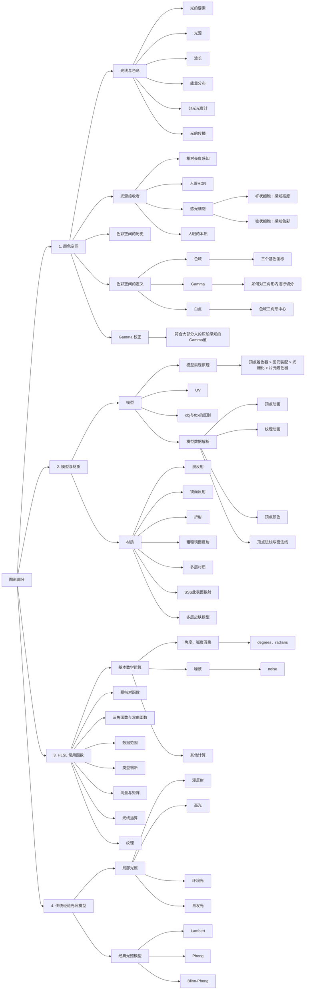

# 总览

# 1. 色彩空间

## 1.1 光线与色彩

### 色彩发送器

**色彩认知：**
光源是出生点，光源发射出光线，光线通过直射反射折射等路径最终进入人眼。但人眼接收到光线后，人眼的细胞产生了一系列化学反应。由此把产生的信号传入大脑，最终大脑对颜色产生了认知感知。

### 光的要素

### 光源
光源就是产生光的物体。

### 波长
光理论上讲是无限大的，只是我们人眼可见光是由局限的。

如果没有光，我们就无法在黑暗中看到色彩，光的本质就是一种物理现象，光在没有进入我们的眼睛前，我们对它的认知是一种波长与能量分布。

### 能量分布
我们讲光线是一种波，那么既然是真实存在的就会有能量，能量单位就是功率，我们认知的光就会有不同的功率。比如一个光是由多个波长组合起来的波形

那么也就是说我们阐述色彩就用这个波长就可以了，但是这么做实在是太反人类了，我们无法保证能简单描述色彩。于是人们发明了一个叫做分光光度计的东西。

### 分光光度计

分光光度计就是用于描述光线的具体能量强度，记得小时候用棱镜分光吗。我们通过分光之后对区间波长进行了感应与测量，最后得知了光谱的分布最终得知光线额能量集中在了550nm附近（上图中绿色地方）

于此我们获得了：
1. 混合波长组成光线，拆分光线，变成光线形成单一波长光 
2. 测量单一波长光的实际所含能量

### 光的传播
回到光线的传播路径上来讨论，我们认知到光是经过了不同路径才进入我们的眼睛中的。
* 直射光：光源直射眼睛
* 折射光：光源穿过物体进入眼睛
* 反射光：光源经过物体表面反射进入眼睛
* 光线追踪：光线弹来弹去，然后我们根据权重确定光线最后进入眼睛中的颜色

下图就是光通过反射之后，在能量上发生的变化，可以明显看到，少了一部分的能量，这是因为一部分的能量被物体吸收了，也就是说每次光经过反射或投射都会或多或少对光的能量分布产生一些影响

简单通过能量分布图分析下右图得出结论： 物体吸收光功率的大部分在600nm左右也就是说物体吸收的光是黄色和绿色的光

## 1.2 光源接收者

### 相对亮度感知
在某些阴暗的环境下，点亮一盏灯，这时人眼就会觉得非常亮。如果同时点亮1000盏灯，反而觉得只是10倍的亮度，对亮度的认知相当于从 0~1 再从 1~10。

### 人眼 HDR
* 人眼既可以分辨出高亮度的云彩的不同层次区别，还可以分辨出阴影中物不同物体的异同。
* 但是人眼的能力并不能保证这两个功能同时生效。

这样一说，反而就能发现人眼真是个变化莫测的存在，它可能会随着不同的环境，感知到不同的色彩，体验到不同的明暗效果，甚至可能会随着盯着某一个点时间流逝而变化颜色。

### 人眼感光细胞分布
* 杆状细胞：感知亮度
* 锥状细胞：感知色彩

感光细胞（杆状细胞）对亮度特别的敏感，只要有 5~14 个光子打到杆状细胞就会产生神经信号，这也可以解释为什么闪光弹能让人致盲，一部分原因就是因为光实在太亮，直接干涉了人眼最敏感的感光细胞

### 锥状细胞
这种细胞专门用于感知颜色，但是他们还被区分为了 L 细胞，M 细胞，S 细胞。

这三种细胞负责感知的波长不一，如图所示，L 感知红色区间，M 感知绿色区间，S 感知蓝色区间

### 人眼的本质
人眼的本质是光源的接收者。他的作用就是接收外部光线输入，输出神经电信号进入大脑。

### 完整积分公式

$C=\int_{min}^{max}S(λ)I(λ)R(λ)dλ$

这个公式简单分成了四个部分
- C值得是人眼这个函数输出的神经电信号
- S(λ) 表示LMS这三个感官细胞的感知分布
- I(λ)表示光源的功率谱分布
- R(λ)表示反射物体的吸收功率分布

## 1.3 色彩空间的历史

### 19 世纪色彩的猜想
1. 人们有 100 多种感受颜色的细胞
2. 人们有三种，分别是 RGB 三种感色细胞
3. 人们有三种，分别是黑白，红绿，黄蓝感色细胞（是不是很眼熟）

现在这么多年过去了，其中的 2 和 3 这两种猜想都成为了我们当下的色彩视觉模型，也称之**色彩模型**

### 1905 Munsell 色彩系统
美国艺术家 Albert Henry Munsell 利用自己的艺术特长，最早提出了一个色彩系统，后来在 1930 年被优化改良。

Munsell 通过很多色卡来描述色彩，下面旋转角度的是色相，Munsell 垂直的是亮度，从圆心到外部是 Munsell 饱和度。 人们凭借自我主观意识认知与区分色彩就是 HSL (色相、饱和亮度)，这套系统没有过多的物理科学在其中，更多的是一种艺术家的理解与归纳总结规范…

这及其方便了描述色彩，一个颜色可以通过： `H = 1.6YR, V = 6.3, C = 3.9` 来描述而且也不会有任何的描述与理解偏差。

于是我们方便起见就为一些常用色彩制作了色卡，一个个色卡描述色彩就非常方便。

### 1931 CIE 1931 RGB Color Specification System
科学家们觉得上述的色彩系统还可以，但是不够科学，于是为了以一种科学的方式阐述色彩，于是一个叫 CIE 的机构在 1931 年建立了一套色彩系统， 希望完全客观完全物理的量化色彩。

#### 色彩匹配方案

CIE 把所有可视波长的光线作为测试光挨个测试了一个遍，最终得到了三条曲线

我们发现 435.8~546.1 nm 这段波长中的红色基色强度是负数。这虽然物理正确，但是一点也没有科学的美感，于是我们进行了归一化，保证色彩在 -1~1 之间。

最终通过计算出 rgb 的基色的强度在当前混色强度的所占比例这样计算后， r' g' b' 都是在 -1~1 之间， 那么我们发现 $r'+g'+b'=1$ ，那么就可以通过其中两个已知数计算出另一个的强度

#### 图像可视化

在对数值归一化之后，两个变量就可以代表色彩了，于是我们就通过 r' g' 这两个参数画图

于是画出了一个二维空间，x 轴是 r'，y 轴是 g' 那么我们就可以成功的在色彩科学上真正科学的描述一个颜色

我们可以把任何可见光通过图标的一个点的坐标来表示说明。

###  XYZ Color Specification System
上文的 CIE1931RGB 色彩系统已经不错了，但是存在负数，这在计算上非常的麻烦，比如写个乘法，得先计算是正数还是负数。

于是人们就用数学的方式做了一个新的色彩空间。所以 XYZ 色彩空间就是一个中转站，主要目的就是简化计算。

#### 如何转换
因为是空间转换所以我们用矩阵的方式进行

$$
\begin{bmatrix}
X \\
Y \\
Z
\end{bmatrix}=
\begin{bmatrix}
2.7689 & 1.7517 & 1.1302 \\
1.0000 & 4.5907 & 0.0601 \\
0.0000 & 0.0565 & 5.5943
\end{bmatrix}
\begin{bmatrix}
R \\
G \\
B
\end{bmatrix}
$$

注： 这里的 RGB 是 CIE 1931RGB 不是 sRGB 中的 RGB 数值。

这个 xyz 矩阵也不太美，于是人们为了计算方便有把xyz矩阵进行了归一化： 
$ x = \frac{X}{X+Y+Z} $
$ y = \frac{Y}{X+Y+Z} $
$ z = \frac{Z}{X+Y+Z} = 1-x-y $

#### 最终效果
那么最终效果就是这张大家应该会比较熟悉的图， 人称**色域马蹄图**

也就是人眼可见范围表示， 但是我们发现图像上面好像没有亮度于是我们就在归一化的基础上，把 XYZ 中的 Y 单独拿出来与 xy 一起组成了 Yxy 色彩空间，其中的 Y 表示亮度 xy 表示色度。

注：这里提一下 这里是 Yxy 色彩空间 Yxy 是由 XYZ 色彩空间衍生

#### 不足与补充
上述的XYZ色彩空间也不错，但是也有问题，就是色彩的分布不均匀，他们的分布色彩一些地方紧一些地方又很松，举个例子这个图的偏向绿色部分就非常平滑，然后左下角部分坐标变化小，但是色彩变化就很快。

于是我们得想办法再去搞个更不错的色彩空间 gkd gkd

## 1.4 色彩空间的定义

色彩空间至少需要满足三项重要指标：
1. 色域 （三个基色的坐标，由此形成三角形）
2. Gamma （如何对三角形内进行切分）
3. 白点 （色域三角形中心）

