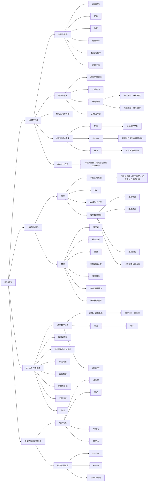

# 总览




# 1. 色彩空间

## 1.1 光线与色彩

### 色彩发送器

**色彩认知：**
光源是出生点，光源发射出光线，光线通过直射反射折射等路径最终进入人眼。但人眼接收到光线后，人眼的细胞产生了一系列化学反应。由此把产生的信号传入大脑，最终大脑对颜色产生了认知感知。

### 光的要素


### 光源
光源就是产生光的物体。

### 波长
光理论上讲是无限大的，只是我们人眼可见光是由局限的。

如果没有光，我们就无法在黑暗中看到色彩，光的本质就是一种物理现象，光在没有进入我们的眼睛前，我们对它的认知是一种波长与能量分布。


### 能量分布
我们讲光线是一种波，那么既然是真实存在的就会有能量，能量单位就是功率，我们认知的光就会有不同的功率。比如一个光是由多个波长组合起来的波形

那么也就是说我们阐述色彩就用这个波长就可以了，但是这么做实在是太反人类了，我们无法保证能简单描述色彩。于是人们发明了一个叫做分光光度计的东西。


### 分光光度计

分光光度计就是用于描述光线的具体能量强度，记得小时候用棱镜分光吗。我们通过分光之后对区间波长进行了感应与测量，最后得知了光谱的分布最终得知光线额能量集中在了550nm附近（上图中绿色地方）

于此我们获得了：
1. 混合波长组成光线，拆分光线，变成光线形成单一波长光 
2. 测量单一波长光的实际所含能量


### 光的传播
回到光线的传播路径上来讨论，我们认知到光是经过了不同路径才进入我们的眼睛中的。
* 直射光：光源直射眼睛
* 折射光：光源穿过物体进入眼睛
* 反射光：光源经过物体表面反射进入眼睛
* 光线追踪：光线弹来弹去，然后我们根据权重确定光线最后进入眼睛中的颜色

下图就是光通过反射之后，在能量上发生的变化，可以明显看到，少了一部分的能量，这是因为一部分的能量被物体吸收了，也就是说每次光经过反射或投射都会或多或少对光的能量分布产生一些影响

简单通过能量分布图分析下右图得出结论： 物体吸收光功率的大部分在600nm左右也就是说物体吸收的光是黄色和绿色的光

<div align=center>


</div>


## 1.2 光源接收者

### 相对亮度感知
在某些阴暗的环境下，点亮一盏灯，这时人眼就会觉得非常亮。如果同时点亮1000盏灯，反而觉得只是10倍的亮度，对亮度的认知相当于从 0~1 再从 1~10。

### 人眼 HDR
* 人眼既可以分辨出高亮度的云彩的不同层次区别，还可以分辨出阴影中物不同物体的异同。
* 但是人眼的能力并不能保证这两个功能同时生效。

这样一说，反而就能发现人眼真是个变化莫测的存在，它可能会随着不同的环境，感知到不同的色彩，体验到不同的明暗效果，甚至可能会随着盯着某一个点时间流逝而变化颜色。

### 人眼感光细胞分布
* 杆状细胞：感知亮度
* 锥状细胞：感知色彩

感光细胞（杆状细胞）对亮度特别的敏感，只要有 5~14 个光子打到杆状细胞就会产生神经信号，这也可以解释为什么闪光弹能让人致盲，一部分原因就是因为光实在太亮，直接干涉了人眼最敏感的感光细胞

### 锥状细胞
这种细胞专门用于感知颜色，但是他们还被区分为了 L 细胞，M 细胞，S 细胞。

这三种细胞负责感知的波长不一，如图所示，L 感知红色区间，M 感知绿色区间，S 感知蓝色区间


### 人眼的本质
人眼的本质是光源的接收者。他的作用就是接收外部光线输入，输出神经电信号进入大脑。

### 完整积分公式

$C=\int_{min}^{max}S(λ)I(λ)R(λ)dλ$

这个公式简单分成了四个部分
- C值得是人眼这个函数输出的神经电信号
- S(λ) 表示LMS这三个感官细胞的感知分布
- I(λ)表示光源的功率谱分布
- R(λ)表示反射物体的吸收功率分布


## 1.3 色彩空间的历史

### 19 世纪色彩的猜想
1. 人们有 100 多种感受颜色的细胞
2. 人们有三种，分别是 RGB 三种感色细胞
3. 人们有三种，分别是黑白，红绿，黄蓝感色细胞（是不是很眼熟）

现在这么多年过去了，其中的 2 和 3 这两种猜想都成为了我们当下的色彩视觉模型，也称之**色彩模型**

### 1905 Munsell 色彩系统
美国艺术家 Albert Henry Munsell 利用自己的艺术特长，最早提出了一个色彩系统，后来在 1930 年被优化改良。

Munsell 通过很多色卡来描述色彩，下面旋转角度的是色相，Munsell 垂直的是亮度，从圆心到外部是 Munsell 饱和度。 人们凭借自我主观意识认知与区分色彩就是 HSL (色相、饱和亮度)，这套系统没有过多的物理科学在其中，更多的是一种艺术家的理解与归纳总结规范…


这及其方便了描述色彩，一个颜色可以通过： `H = 1.6YR, V = 6.3, C = 3.9` 来描述而且也不会有任何的描述与理解偏差。

于是我们方便起见就为一些常用色彩制作了色卡，一个个色卡描述色彩就非常方便。

### 1931 CIE 1931 RGB Color Specification System
科学家们觉得上述的色彩系统还可以，但是不够科学，于是为了以一种科学的方式阐述色彩，于是一个叫 CIE 的机构在 1931 年建立了一套色彩系统， 希望完全客观完全物理的量化色彩。


#### 色彩匹配方案

CIE 把所有可视波长的光线作为测试光挨个测试了一个遍，最终得到了三条曲线

我们发现 435.8~546.1 nm 这段波长中的红色基色强度是负数。这虽然物理正确，但是一点也没有科学的美感，于是我们进行了归一化，保证色彩在 -1~1 之间。

最终通过计算出 rgb 的基色的强度在当前混色强度的所占比例这样计算后， r' g' b' 都是在 -1~1 之间， 那么我们发现 $r'+g'+b'=1$ ，那么就可以通过其中两个已知数计算出另一个的强度


#### 图像可视化

在对数值归一化之后，两个变量就可以代表色彩了，于是我们就通过 r' g' 这两个参数画图

于是画出了一个二维空间，x 轴是 r'，y 轴是 g' 那么我们就可以成功的在色彩科学上真正科学的描述一个颜色

我们可以把任何可见光通过图标的一个点的坐标来表示说明。


###  XYZ Color Specification System
上文的 CIE1931RGB 色彩系统已经不错了，但是存在负数，这在计算上非常的麻烦，比如写个乘法，得先计算是正数还是负数。

于是人们就用数学的方式做了一个新的色彩空间。所以 XYZ 色彩空间就是一个中转站，主要目的就是简化计算。


#### 如何转换
因为是空间转换所以我们用矩阵的方式进行

$$
\begin{bmatrix}
X \\
Y \\
Z
\end{bmatrix}=
\begin{bmatrix}
2.7689 & 1.7517 & 1.1302 \\
1.0000 & 4.5907 & 0.0601 \\
0.0000 & 0.0565 & 5.5943
\end{bmatrix}
\begin{bmatrix}
R \\
G \\
B
\end{bmatrix}
$$

注： 这里的 RGB 是 CIE 1931RGB 不是 sRGB 中的 RGB 数值。

这个 xyz 矩阵也不太美，于是人们为了计算方便有把xyz矩阵进行了归一化： 
$x = \frac{X}{X+Y+Z}$
$y = \frac{Y}{X+Y+Z}$
$z = \frac{Z}{X+Y+Z} = 1-x-y$

#### 最终效果
那么最终效果就是这张大家应该会比较熟悉的图， 人称**色域马蹄图**

也就是人眼可见范围表示， 但是我们发现图像上面好像没有亮度于是我们就在归一化的基础上，把 XYZ 中的 Y 单独拿出来与 xy 一起组成了 Yxy 色彩空间，其中的 Y 表示亮度 xy 表示色度。

注：这里提一下 这里是 Yxy 色彩空间 Yxy 是由 XYZ 色彩空间衍生


#### 不足与补充
上述的XYZ色彩空间也不错，但是也有问题，就是色彩的分布不均匀，他们的分布色彩一些地方紧一些地方又很松，举个例子这个图的偏向绿色部分就非常平滑，然后左下角部分坐标变化小，但是色彩变化就很快。

于是我们得想办法再去搞个更不错的色彩空间 gkd gkd

## 1.4 色彩空间的定义

色彩空间至少需要满足三项重要指标：
1. 色域 （三个基色的坐标，由此形成三角形）
2. Gamma （如何对三角形内进行切分）
3. 白点 （色域三角形中心）


### Gamma

Gamma 并不是色彩空间，它其实只是如何对色彩进行采样的一种方式

每次对比顶点切割，就会发现切割的方式不同会导致每次对应的色彩不一样，大家通常理解的 Gamma=1 的情况就是指代这样均匀的切分，这样的好处就是方便计算。
而非均匀切割的方式就是 Gamma≠1


比如我们有个常用的空间 sRGB，那么 sRGB 的构成：
1. 色域： sRGB 首先设定了 RGB 三个基色的坐标
2. 白点： sRGB 也规定了白点位置
3. gamma： sRGB 的 gamma 设定为≈2.2（上右图）也就是说从外而向内切，先切的很细，然后逐渐变粗

大家知道线性的好处 (也就是 gamma=1 的时候)，方便计算，计算机效率高，方便理解，但是计算机储存（不需要花费很多空间去存储亮的区域）与显示器硬件因为早期的性能问题，采用的基本大部分都是 gamma≈2.2 的情况，但是我们目前大部分的机器都已经不是远古版本了，所以 PC 上的大部分游戏都会推荐使用 Linear 线性空间

我们可以自定义色彩空间，换一个色域，换一个白点位置，换一个 gamma 值其实就是一个新的色彩空间了。

所以也可以存在 sRGB D65 linear 这类空间，所以任何色彩空间都可以是 linear 线性的（改 gamma 值就可以去确定），但 linear 本身并不是一个色彩空间，它只是一个 gamma 值

### 1.5 常用的色彩模型和色彩空间

* 色彩模型：使用一定规则描述（排列）颜色的方法
举例：RGB、CMYK、LAB
* 色彩空间：需要至少满足三个指标：色域、白点、gamma
举例：CIE XYZ、 Adobe RGB、 sRGB、Japan Color 2001 Uncoated、US web Coated（后两个是基于CMYK模型建立的）


### 1.6 色彩空间转换


----------------------------------------------------------------------------------


# 2. 模型与材质

## 2.1 模型

### 图形渲染管线


### 模型的实现原理
点连接成线，线围成面，组成多边形，至此一个模型空间下的模型形成


### UV
UV 平铺在一个二维坐标系中，模型的每个顶点在三维空间和二维空间中都能一一对应，在二维坐标系中的顶点对应的位置就是顶点的纹理坐标，因此每个顶点都能利用纹理坐标获取到贴图所存储的信息

在建模软件中进行 UV 展开，UV 会放在一个横轴为 U，纵轴为 V，范围为（0~1）的二维坐标系中

### 一个模型包含的信息（以 obj 文件为例）
V：顶点坐标数据（模型空间中单个顶点的 XYZ 坐标）
VT：贴图坐标（水平方向是 U，垂直方向是 V，范围在 0~1 之间）
VN：顶点法线→会决定面的朝向
顶点色：单个顶点的 RGBA 通道颜色信息


### obj 格式与 fbx 格式的区别


参考：https://www.cnblogs.com/kekec/p/12446200.html

## 2.2 材质
在现实世界里，每个物体会对光产生不同的反应：有些物体反射光的时候不会有太多的散射 (Scatter)，因而产生一个较小的高光点而有些物体则会散射很多，产生一个有着更大半径的高光点


### 漫反射
漫反射是最容易模拟的模型。
最简单的 Lambertian 很简单粗暴的认为光线 均匀地反射出去
`Diffuse = BaseColor * LightColor * dot(LightDir, NormalDir)`


### 镜面反射
镜面反射就是将入射光线根据表面法线进行反射，并且只有在反射方向有能量，其他方向能量均为 0
`Specular = LightColor * pow(dot(ReflectDir, ViewDir), x)`


### 折射
对于玻璃这种电介质，除了反射之外还有根据物体的折射率折射一部分光线进入物体之中反射和折射能量的多少是根据菲尼尔定律决定
```
ReflDir = refract(ViewDir, NormalDir, ration)
ReflColor =  texCUBE(skybox, ReflDir)
```


### 粗糙镜面反射
法线偏移较小。反射依然集中在一个区域。形成有磨砂质感的金属表面。


### 粗糙镜面折射
毛玻璃效果


### 多层材质
涂了油漆的地板


### SSS 次表面散射
多发生在半透明的物体上，如玉石、牛奶、皮肤、蜡烛

光进入皮肤后照亮了毛细血管，因此在明暗交界处更容易看到反射出的红光


### 多层皮肤模型
我们把皮肤看成三层：油脂层（微量、很薄），表皮层，真皮层
* 正是因为有油脂层，油脂层直接把光反射出去，所以皮肤上才会有高光产生
* 没有被反射的光通过折射进入子表面层，光进入这些层之后被部分吸收（获得颜色）和散射
* 再从皮肤中入射点附近的出射点射出
* 这个过程就产生了次表面散射的效果


### 改变材质表面
现实世界中不存在完美平滑的表面，因此需要对模型表面的法线进行扰动。
其中一个方法是使用法线贴图。
漫反射，高光，折射，都与法线有关，因此改变法线，就能改变其光照计算结果


## 2.3 模型数据在渲染中的作用

1. 顶点动画：在顶点着色器中，修改模型的顶点位置。进而达到模型运动的效果
2. 纹理动画：在片段着色器中，修改模型的 UV 信息，使得采样贴图时，发生位移而产生运动效果
3. 顶点色：在渲染时，影响输出结果。控制颜色范围

### 纹理动画

在片段着色器中，修改模型的 UV 信息，使得采样贴图时，发生位移而产生运动效果。

UV 坐标动画或 UV 平移的含义是：水平（U）和/或垂直（V）移动纹理的 UV 坐标，以产生复杂动画的错觉。

#### 原理1：利用法线贴图，改变反射与折射的朝向

修改前，使用 1 这个法线，反射出去的就是 1 
修改后，使用 2 这个法线，反射出去的就是 2 
修改的只是法线信息，因此其他数据还是保持修改之前的样子


#### 原理2：改变UV采样点的位置，产生动画效果


### 顶点动画

顶点动画就是在顶点着色器中对纹理的顶点进行进行操作进而产生动画效果。

顶点着色器计算的是模型的每一个顶点，每个顶点的数据是不同的，因此同一个计算公式在不同的顶点上，计算出来的结果也是不同的

在一些三维建模软件中 ，动画的K帧也是一种顶点动画

#### 原理
顶点动画需要一定数量的顶点，效果才会比较明显

一个顶点传入一个顶点着色器，顶点着色器控制顶点位置时所有的顶点都会进行一样的算法。
获取顶点 UV 坐标，控制移动的数值大小 (UV 范围0-1)


### 顶点色
因四边面本质上还是三角面组合而成，所以在绘制时会出现三角形的分界
`FragColor =  FinalColor * VertexColor; `


#### 原理：通过重心坐标插值计算

**重心坐标**

$(x,y) = \alpha A + \beta B + \gamma C = \alpha + \beta + \gamma = 1$

$\alpha = \frac {-(x - x_B)(y_C - y_B) + (y - y_B)(x_C - x_B)} {-(x_A - x_B)(y_C - y_B) + (y_A - y_B)(x_C - x_B)}$

$\beta = \frac {-(x - x_C)(y_A - y_C) + (y - y_C)(x_A - x_C)} {-(x_B - x_C)(y_A - y_C) + (y_B - y_C)(x_A - x_C)}$

$\gamma = 1 - \alpha - \beta$


插值操作是在光栅化阶段进行的。所以这些 XY 坐标可以理解为屏幕坐标。
点 D 的真实坐标为 (x,y)，重心坐标为 (α,β,γ) 该点是三个顶点直角坐标的线性组合系数之和为1 每个系数都是非负的

#### 重心坐标颜色插值


### 顶点法线和面法线


效果：


#### 原理：

* **面法线**：未使用平滑时，**三角形三个顶点共用一个法线**。 那么插值时，因为三个顶点的法线相同，所以**插值的结果相同**。
* **顶点法线**：使用平滑后，**一个顶点一个法线**。三角形三个顶点的法线也就不相同。**插值结果也就会不同**。


#### 在模型文件内部存储方式


#### 扩展
在 NPR 渲染中。通常在顶点着色器中，将顶点往法线方向偏移。然后再片段着色器中直接输出一个颜色，达到描边的效果。
BackFacing 描边时，线条之间断开就是因为没有使用顶点法线（没有进行平滑着色）


-------------------------------------------------------------------------


# 3. HLSL 常用函数

* 官方文档：
https://learn.microsoft.com/en-us/windows/win32/direct3dhlsl/dx-graphics-hlsl-intrinsic-functions

* 一个实用的函数可视化网站：
https://graphtoy.com/


## 3.1 基本数学运算
 函数 | 说明 | 示例
 --- | --- | ---
 max(x,y)   | 返回 x 和 y 两者中较大的那个数
 min(x,y)   | 返回 x 和 y 两者中较小的那个数
 mul(x,y)   | 两变量相乘，常用于矩阵运算，如果 x 是向量，则被视为行向量；如果 y 是向量，则被视为列向量
 abs(x)     | 取绝对值  | 
 round(x)   | 返回与 x 最近的整数（四舍五入）   | 
 sqrt(x)    | 返回 x 的平方根  | 
 rsqrt(x)   | 返回 x 的平方根的倒数  | 
 degrees(x) | 将弧度转换成角度  | 
 radians(x) | 将角度转换成弧度  | 
 noise(x)   | 根据传入的浮点型向量，返回基于一个 Perlin-noise 算法的范围在 -1~1 之间的噪波值  | 


## 3.2 幂指对函数
 函数 | 说明 
 --- | --- 
 pow(x,y)   | 返回 x 的 y 次幂（x 和 y 均可为常量或变量）  
 exp(x)     | 返回以 e 为底，x 为指数的幂，即 $e^x$ 
 exp2(value x) | 返回以 2 为底，x 为指数的幂，即 $2^x$ 
 ldexp(x,exp) | 返回 x 与 2 的 exp 次方的乘积，即 $x*2^{exp}$ 
 log(x)     | 返回指定值的以 e 为底的对数，即 $lnx$ 
 log10(x)   | 计算以 10 为底的对数，即 $log_{10}x$ 
 log2(x)    | 计算以 2 为底的对数，即 $log_{2}x$ 
 frexp(x,out exp) | 把浮点数 x 分解成尾数和指数， $x=ret*2^{exp}$ <br/> 函数返回值为尾数，exp 为指数（原始浮点数的二进制指数）<br/> 如果 x 参数为 0，则此函数的尾数和指数均返回 0 


## 3.3 三角函数与双曲函数
 函数 | 说明 
 --- | --- 
 asin(x)    | 返回输入值的反正弦值
 acos(x)    | 返回输入值的反余弦值
 atan(x)    | 返回输入值的反正切值
 atan2(y,x) | 返回 y/x 的反正切值
 sin(x)、cos(x)、tan(x)、tan(y/x)     | 正弦、余弦、正切、y/x 的正切
 sincos(x,out s,out c) | 返回 x 的正弦值和余弦值
 sinh(x)    | 返回 x 的双曲正弦值，即 $(e^x-e^{-x})/2$
 cosh(x)    | 返回 x 的双曲余弦值，即 $(e^x+e^{-x})/2$
 tanh(x)    | 返回 x 的双曲正切值，即 $(e^x-e^{-x})/(e^x+e^{-x})$


## 3.4 数据范围类
 函数 | 说明 
 --- | --- 
 ceil(x)    | 返回 >= x 的最小整数（向上取整）
 floor(x)   | 返回 <= x 的最大整数（向下取整）
 step(x,y)  | 如果 x <= y，返回 1（真），否则返回 0
 saturate(x)| 将 x 钳制到 [0,1] 范围之间
 clamp(x,min,max) | 将 x 限制在 [min,max] 范围的值，比 min 小返回 min，比 max 大返回 max
 fmod(x,y)  | 返回 x 对 y 取余的余数
 frac(x)    | 取 x 的小数部分
 modf(x,out ip) | 将 x 分为小数和整数部分（输出的 ip 为整数部分，返回值为小数部分）
 lerp(x,y,s) | 按照 s 在 x 到 y 之间插值，返回 $x*(1-s)+y*s$
 smoothstep(min,max,x) | 如果 x 在 [min,max] 范围内，就返回介于 [0,1] 之间的平滑 Hermite 插值，使用 smoothstep 在两个值直接创建平滑过渡 <br/> eg，平滑地混合两种颜色


## 3.5 类型判断类
 函数 | 说明 
 --- | --- 
 all(x)     | 确定指定量的所有分量是否均为非零，均非零则返回 true，否则返回 false（处理由浮点型、整型、布尔型数据定义的标量、向量或者矩阵）
 clip(x)    | 如果输入值小于零，则丢弃当前像素 常用于判定范围(不仅仅针对 0,返回值为 void) <br/> 常用于 Alpha Test，如果每个分量代表到平面的距离，还可以用来模拟剪切平面
 sign(x)    | 返回 x 的正负性 <br/> 如果 x < 0，返回 -1 <br/> 如果 x = 0，返回 0 <br/> 如果 x > 0，返回 1
 isinf(x)   | 如果 x 参数为 + INF 或 - INF（无穷 + 无穷仍无穷，0x3f3f3f3f），返回 true，否则返回 false
 isfinite(x)| 判断 x 参数是有限的，即有界的，与 isinf(x) 相反
 isnan(x)   | 如果 x 参数为 NAN（非数字），返回 true，否则返回 false


## 3.6 向量和矩阵类
 函数 | 说明 
 --- | --- 
 length(v)  | 返回向量的长度
 normalize(v) | 向量归一化，x/length(x)    方向向量归一化
 distance(a,b) | 返回两个向量之间的距离，不平行的两个向量应该为 0，此处表示为根号下各分量之差的平方和
 dot(a,b)    | 点积
 cross(a,b)  | 叉积
 determinant(m) | 返回指定浮点矩阵的按行列式方式计算的值
 transpose(m) | 返回矩阵 m 的转置矩阵


## 3.7 光线运算类
 函数 | 说明 
 --- | --- 
 reflect(i,n) | 以 i 为入射向量 n 为法线方向的反射光
 refract(i,n,ri) | 以 i 为入射向量 n 为法线方向, ri 为折射率的折射光
 lit(n_dot_l,n_dot_h,m) | 输入标量 (normal,light,半角向量 h,镜面反射系数 m) <br/> 返回光照向量 (环境光，漫反射光，镜面高光反射，1)
 faceforward(n,i,ng) | 得到面向视图方向的曲面法向量，输入输出为同元向量，返回 `-n * sign(dot(i,ng)) (normal,light,normal)`


## 3.8 纹理查找
* 所有的纹理查找函数都可以分为三类：普通的、微分的、投影的

**偏导函数ddx ddy（微分类）**
* 如果函数 ddx 的参数为 myVar，该参数对应的像素点记为 p(i, j)，则 ddx(myVar)  的值为：像素点 p(i+1, j) 的值减去myVar（ddy同理）
* 如果函数 ddx 和 ddy 的输入参数为常数，则函数返回值永远为 0。
* 1.函数 ddx 和 ddy 用于求取相邻像素间某属性的差值；
* 2.函数 ddx 和 ddy 的输入参数通常是纹理坐标；
* 3.函数 ddx 和 ddy 返回相邻像素键的属性差值；偏导数的物理含义是：在某一个方向上的变化快慢。
  * 所以 ddx 求的是 X 方向上，相邻两个像素的某属性值的变化量
  * ddy 求的是 Y方向上，相邻两个像素的某属性值的变化量
* 由于 ddx 和 ddy 指令是作用于像素级的，所以 ddx 和 ddy 函数只被片段程序所支持
* mipmap在选择到底用哪一层mipmap的level时，靠的就是偏导数。

**投影类**
* 投影纹理是指：将纹理当做一张幻灯片投影到场景中，使用投影纹理技术需要计算投影纹理坐标，然后使用投影纹理坐标进行查询。使用投影纹理坐标进行查询的函数就是投影纹理查询函数。

**Mipmap类**
* lod    采样一张mipmap
* bias    偏置后再采样（由t，w决定）
* grad    使用微分来选择mip的层，进行采样

### 1D 纹理查找（几乎不用）
GPU 在 PS 阶段是在屏幕空间 XY 坐标系中对每一个像素去对应的纹理中查找对应的纹素来确定像素的颜色

 函数 | 说明 
 --- | --- 
 tex1D (s, t)    | 普通一维纹理查找 返回纹理采样器 s 在标量 t 位置的 color4
 tex1D (s,t,ddx,ddy) | 使用微分查询一维纹理 t 和 ddxy 均为 vector
 tex1Dlod (s, t) | 使用 LOD 查找纹理 s 在 t.w 位置的 color4
 tex1Dbias (s, t)    | 将 t.w 决定的某个 MIP 层偏置后的一维纹理查找
 tex1Dgrad (s,t,ddx,ddy) | 使用微分并指定 MIP 层的一维纹理查找
 tex1Dproj (s, t)    | 把纹理当做一张幻灯片投影到场景中，先使用投影纹理技术需要计算出投影纹理坐标 t (坐标 t.w 除以透视值)，然后使用投影纹理坐标进行查询


### 2D 纹理查找
函数 | 说明 
--- | --- 
tex2D (s, t)    | 普通二维纹理查找 返回纹理采样器 s 在 vector t 位置的颜色
tex2D (s,t,ddx,ddy) | 使用微分查询二维纹理 t 和 ddxy 均为 vector（只有小于 ddxy 的值才会采样）
tex2Dlod (s, t) | 使用 LOD 查找纹理 s 在 t.w 位置的 color4
tex2Dbias (s, t)    | 将 t.w 决定的某个 MIP 层偏置后的二维纹理查找
tex2Dgrad (s,t,ddx,ddy) | 使用微分并指定 MIP 层的二维纹理查找
tex2Dproj (s, t)    | 把纹理当做一张幻灯片投影到场景中，先使用投影纹理技术需要计算出投影纹理坐标 t (坐标 t.w 除以透视值)，然后使用投影纹理坐标进行查询


### 3D 纹理查找
函数 | 说明 
--- | --- 
tex3D (s, t)    | 普通三维纹理查找 返回纹理采样器 s 在 vector t 位置的颜色
tex3D (s,t,ddx,ddy) | 使用微分查询三维纹理 t 和 ddxy 均为 vector
tex3Dlod (s, t) | 使用 LOD 查找纹理 s 在 t.w 位置的 color4
tex3Dbias (s, t)    | 将 t.w 决定的某个 MIP 层偏置后的三维纹理查找 
tex3Dgrad (s,t,ddx,ddy) | 使用微分并指定 MIP 层的三维纹理查找
tex3Dproj (s, t)    | 把纹理当做一张幻灯片投影到场景中，先使用投影纹理技术需要计算出投影纹理坐标 t (坐标 t.w 除以透视值)，然后使用投影纹理坐标进行查询


### 立体纹理查找
函数 | 说明 
--- | --- 
texCUBE (s,t)   | 返回纹理采样器 s 在 vector t 位置的颜色
texCUBE (s,t,ddx,ddy)   | 使用微分查询立方体维纹理 t 和 ddxy 均为 vector
texCUBEDload (s,t)  | 使用 LOD 查找纹理 s 在 t.w 位置的 color4
texCUBEbias (s,t)   | 将 t.w 决定的某个 MIP 层偏置后的立方体纹理查找
texCUBEgrad (s,t,ddx,ddy)   | 使用微分并指定 MIP 层的立方体纹理查找
texCUBEproj (s,t)   | 使用投影方式的立方体纹理查找


--------------------------------------------------------------------


# 4. 传统经验光照模型

## 4.1 光照模型 illumination model
是一种模拟自然界光照的物理过程的一种计算机模型，即光线与空间中物体表面的交互模型，大致分为两类：
1. 基于物理的光照模型（PBR）（有可依据的公式）
2. 经验模型（进行了一些近似、模拟，所以会不准）

#### 为什么需要光照模型
现实世界光照复杂，使用简化的光照模型对现实世界的光照情况进行模拟

#### 光照模型的发展


## 4.2 局部光照模型

### 局部光照的定义
● 只考虑光源的影响，不考虑光线多次反射
● （对应的概念：全局光照=直接光照+间接光照）


局部光照模型满足叠加原理，可以基本将光线分为四个部分


### 局部光照模型的组成

局部光照模型满足叠加原理，可以基本将光线分为四个部分：
* 漫反射
* 高光反射
* 环境光
* 自发光

#### 漫反射
* 光线均匀被反射到各个方向
* 漫反射过程中，光线发生了吸收和散射，因此改变颜色和方向
* 漫反射只与光源和表面法线有关

使用 Lambert 余弦定理计算：


#### 高光反射
* 描述了光线与物体表面发生的反射（光强不变，方向改变）
* 反射率根据菲涅尔效应决定
* Gloss 影响了高光反射的范围，但高光的亮度是不变的
* 高光反射与观察方向有关


#### 环境光


#### 自发光：物体自身发出的光
物体自身发射的光线，通常作为单独的一项加入光照模型一般使用一张发光贴图描述物体的自发光


## 4.3 经典光照模型

### Lambert 模型
只计算漫反射，没有高光效果
`color = C_light * albedo * dot(normal, light);`

### Phong 模型
`Phong = Ambient + Diffuse + Specular`

使用环境光来模拟间接光照
加上了高光反射（使用反射光线方向和视线方向进行计算）


### Blinn-Phong 模型
在计算高光反射时，用的是半角向量和法线向量


### Phong 和 Blinn-Phone 模型的区别
Blinn-Phong 模型使用了半角向量与法线的点积代替了反射向量与视线的点积结果。

半角向量的使用带来的变化：
1. 计算更简洁（计算半角向量比计算反射向量更简洁）
2. 半角向量与法线的角度永远不会大于90度（但是反射光线与视线方向的角度会大于90度，导致点乘计算的值钳制在0，出现明显的边缘效果）


### Gourand 模型

* 逐顶点计算
* 镜面高光效果差


### Flat 模型


### 光照模型展示
总结：
* Lambert 模型只考虑表面的漫反射部分
* Phong 模型能够较好的呈现镜面高光的效果，也是四种模型中最接近真实的效果，需要计算较复杂的反射向量
* Blinn-Phong 模型效果与 Phong 模型相近，更偏向艺术性的效果，使用方便计算的半程向量代替较为复杂的反射向量，计算量小于Phong，是效果和效率的最佳选择，也是大多数情况下的默认光照模型
* Gourand 模型计算顶点光照并通过增量法插值计算多边形内部的光强，当顶点密度低时，表现效果很差，对于高光的效果也不尽如意，计算量较小


