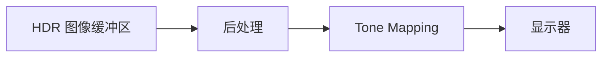

# 5. Gamma 校正

## 5.1 Gamma 校正

### 颜色空间

* 通用：sRGB
* 电影：DCI-P3
* 电视：Rec-709、PAL等
* 印刷：CMYK、Adobe RGB
* 其他


sRGB 和 Rec-709 能表达的颜色空间范围是差不多的，他的三原色位置是差不多的。它们之间的区别就在于传递函数不同

### 传递函数
把颜色显示到一个电子设备上时，需要把颜色转换成一个视频信号，这时候就需要一个传递函数

一个传递函数分为两部分：
* OETF：光转电传递函数，负责把场景线性光转到非线性视频信号值
* EOTF：电转光传递函数，负责把非线性视频信号值转换成显示光亮度


### Gamma校正
简单定义：
* $V_{out} = V_{in}^{gamma}$
* **Gamma 是指对线性三色值和非线性视频信号之间进行编码和解码的操作。**
就比如说当相机拍摄到自然中的线性的光信号，传递到电脑中进行存储时，就需要进行一个 Gamma 的编码操作，获得非线性的视频信号；最后通过显示器显示时，又需要将非线性的视频信号还原回一个线性的光信号，这时就需要进行一个 Gamma 的解码操作，最后得到我们所见到的样子（线性的光信号）


Gamma 矫正的实例：简单理解为就是线性显示、非线性存储。


* 图像经过 gamma 编码存储在硬盘中，将获取到的物理数据做一次 gamma 值约为 0.45 的映射，这样的过程叫做 gamma 编码。
由曲线可知，此时图像的像素比实际物理像素要更亮
* 在显示图像时，需要将每个像素做一次 gamma 值约为 2.2 的矫正，使最终的结果为正确的物理数据。
经过显示的 gamma 校正之后，之前偏亮的图像亮度降低 


#### 进行 Gamma 矫正的原因
这其实和人眼的特性有关，**人眼对暗部的变化要更加敏感一点**。如果要存储更多的有效信息，就需要更多的位置去存储暗部值，即在存储暗部时用更高精度的值去存储，而对于亮部则可以用相对精度较低的值去存储。

所以，非线性转换的目的主要是为了优化存储空间和带宽，传递函数能够更好地帮我们利用编码空间。


## 5.2 韦伯定律


**韦伯定律**：即感觉的差别阈限随原来刺激量的变化而变化，而且表现为一定的规律性，用公式来表示，就是 △Φ/Φ=C，其中 Φ 为原刺激量，△Φ 为此时的差别阈限，C 为常数，又称为韦柏率。

简单来说就是，当所受刺激越大时，需要增加的刺激也要足够大才会让人感觉到明显变化，但是只适用于中等强度的刺激

### 小结
1. 人眼对暗部变化比亮部更加敏感
2. 我们目前所使用的真彩格式 RGBA32，每个颜色通道只有8位用于记录信息，为了合理使用带宽和存储空间，需要进行非线性转换。
3. 目前我们所普遍使用的 sRGB 颜色空间标准，他的传递函数 gamma 值为 2.2(2.4)


### CRT
早期我们使用的图像显示器都是CRT（学名:阴极射线显像管），人们发现这种设备的亮度与电压并不成线性关系，而是 gamma 值约为 2.2 类似幂律的关系。 


#### CRT与转换函数
1. CRT非线性响应的历史原因
2. 人眼对暗部颜色变化更加敏感


### 中灰值
**中灰值并非一个明确的值，而是取决于实际的视觉感受**


## 5.3 线性工作流
* 线性工作流就是在生产的各个环节中，正确使用 gamma 编码和 gamma 解码，使得最终得到的颜色数据与最初输入的物理数据保持一致
* 如果使用 Gamma 空间的贴图，在传给着色器前需要从 Gamma 空间转到线性空间，以确保获得正确的计算结果

如果不在线性空间下进行渲染工作：
Gamma 空间中进行亮度计算时，会容易过曝：因为光线信息在经过 Gamma 编码后，他的值比实际上的要大


进行颜色混合时，也会让亮度过高，出现 “黑边” 


进行光照渲染时，如果把中灰色以 0.5 作为实际的物理光强进行计算的话，就会出现如下左图的情况；但是实际上中灰色的物理光强度应该是 0.18


## 5.4 Unity 中的颜色空间
通过点击菜单 Edit -> Project Settings -> Player 页签 -> Other Settings 下的 Rendering 部分进行修改，参数 Color Space 可以选择 Gamma 或 Linear


* 当选择 Gamma Space 时，Unity 不会做任何处理
* 当选择 Linear Space 时，引擎的渲染流程在线性空间计算，理想情况下项目使用线性空间的贴图颜色，不需要勾选 sRGB，如果勾选了 sRGB 的贴图，会通过硬件特性采样时进行线性转换。


#### 硬件支持
线性空间需要图形 API 的硬件支持，目前支持的平台有：
1. Windows，Mac OS x 和 Linux
2. Xbox One
3. PS4（新的 PS5 肯定支持）
4. Android
5. IOS
6. WebGL（新的 WebGPU 肯定支持）

#### 硬件特性支持
主要由两个硬件特性来支持：
* sRGB Frame Buffer
    * 将 shader 的计算结果输出到显示器前进行 Gamma 矫正
    * 作为纹理被读取时自动会把存储的颜色从 sRGB 空间转换到线性空间
    * 调用 ReadPixels ()、ReadBackImage () 时，会直接返回 sRGB 空间下的颜色
    * sRGB Frame Buffer 只支持每通道为 8bit 的格式，不支持浮点格式
    * HDR 开启后会先把渲染结果绘制到浮点格式的 Frame Buffer 中，最后绘制到 sRGB Frame Buffer 上输出
* sRGB Sampler
    * 将 sRGB 的贴图进行线性采样的转换

使用硬件特性完成 sRGB 贴图的线性采样和 shader 计算结果的 gamma 矫正，比起在 shader 里对贴图采样和计算结果的矫正要快

## 5.5 资源导出问题

### SP 贴图导出
SP 贴图导出时，线性的颜色值经过了 gamma 变换，颜色被提亮了，所以在 unity 中需要勾选 sRGB 选项，让他在采样时能还原回线性值。


### PhotoShop
如果使用线性空间，一般来说 PS 可以什么都不改，导出的贴图只要勾上 sRGB 即可
如果调整 PS 的 gamma 值为 1，导出的贴图在 unity 中也不需要勾选 sRGB 了


* PS 对颜色管理特别精准，Unity 中看到的颜色要经过显示器的 gamma 变换，而 PS 不会，PS 会读取显示器的 Color Profile，反向补偿回去。所以 PS 里使用的是一个真实的颜色值
* PS 有第二个 Color Profile（Document Color Profile）。通常它的默认值就是 sRGB Color Profile，和显示器的 Color Profile 一致，颜色是被这个 Color Profile 压暗了，所以 PS 中看到的结果才和 Unity 的一样（通过一个灰度值来控制颜色的显示，并且这个灰度值和显示器的 gamma 值一致，让我们看着和 unity 一样）

#### 半透明混合
Unity 在进行半透明混合时，会先将它们转换到一个线性空间下，然后再进行混合。但是 PS 中，图层和图层之间做混合的时候，每个上层的图层都会读取他们的 Color Profile，经过一个 Gamma 变换，再做混合，得到的结果就会偏暗一些。


### Unity 中的颜色空间转换函数
Unity CG.cginc 文件中封装的函数
其中，带有 Exact 后缀的的函数计算精确，但消耗高；不带有 Exact 后缀的函数是一种近似解法

``` glsl
inline float GammaToLinearSpaceExact (float value)
{
    if (value <= 0.04045F)
        return value / 12.92F;
    else if (value < 1.0F)
        return pow((value + 0.055F)/1.055F, 2.4F);
    else
        return pow(value, 2.2F);
}

inline half3 GammaToLinearSpace (half3 sRGB)
{
    // Approximate version from http://chilliant.blogspot.com.au/2012/08/srgb-approximations-for-hlsl.html?m=1
    return sRGB * (sRGB * (sRGB * 0.305306011h + 0.682171111h) + 0.012522878h);

    // Precise version, useful for debugging.
    //return half3(GammaToLinearSpaceExact(sRGB.r), GammaToLinearSpaceExact(sRGB.g), GammaToLinearSpaceExact(sRGB.b));
}

inline float LinearToGammaSpaceExact (float value)
{
    if (value <= 0.0F)
        return 0.0F;
    else if (value <= 0.0031308F)
        return 12.92F * value;
    else if (value < 1.0F)
        return 1.055F * pow(value, 0.4166667F) - 0.055F;
    else
        return pow(value, 0.45454545F);
}

inline half3 LinearToGammaSpace (half3 linRGB)
{
    linRGB = max(linRGB, half3(0.h, 0.h, 0.h));
    // An almost-perfect approximation from http://chilliant.blogspot.com.au/2012/08/srgb-approximations-for-hlsl.html?m=1
    return max(1.055h * pow(linRGB, 0.416666667h) - 0.055h, 0.h);

    // Exact version, useful for debugging.
    //return half3(LinearToGammaSpaceExact(linRGB.r), LinearToGammaSpaceExact(linRGB.g), LinearToGammaSpaceExact(linRGB.b));
}
```


---------------------------------------------------------------


# 6. LDR 与 HDR

## 6.1 基本概念
* HDR：High Dynamic Range
* LDR：Low Dynamic Range

动态范围 = 最高亮度 / 最低亮度
将场景中高动态范围的光线信息，转换到显示设备上可显示出来的低动态范围的视频信息，这一过程被称为色调映射（Tone Mapping）

Tips：电脑显示器的最高亮度是由之前经验积累下来的一个，让人眼舒适的，相对统一的亮度。

### LDR
* 通常 LDR 的精度范围是 8 位（2 的 8 次方）
* 0-1 的单通道
* 常用的存储格式为 jpg、png、tga
* 拾色器、一般的图片，电脑屏幕都是 LDR


### HDR
* 远高于 8 位的精度
* 单通道的最大值可超过 1
* 常用 HDR 图片存储格式有 hdr、tif、exr、raw
* HDRI、真实世界的光都是 HRD

### 相机记录信息的过程
* 首先，将曝光值进行计算，将曝光值重新映射回相机能够感应的范围内（受到光圈、快门时间，以及传感器灵敏度等的影响）
* 再把值进行输出（线性），存储进数码相机的格式内
* 之后会经过一个线性变换（白平衡、色彩矫正、色调验色以及伽马矫正等这一系列过程），最终会得到一张 LUT 图
* 不同相机厂商 LUT 图的格式是不同的

### 为什么需要 HDR
* LDR 是对现实颜色进行压缩并且呈现出来，具有一定局限性，在进行后期效果调整和后续加工会因为颜色精度不够而难以进行
* HDR 有着更好的色彩，更高的动态范围和更丰富的细节，并且能够有效地防止画面过曝，亮度值超过 1 的颜色也能很好的表现出来。使得像素光亮度变得正常，视觉传达更加真实。


只有 HDR 才有超过 1 的数值，才有光晕（bloom）的效果, 高质量的 bloom 能体现画面的渲染品质。


## 6.2 在 Unity 中设置 HDR

#### Camera 的 HDR 选项
可以在 Project Setting - Graphics - Tier Settings 中设置是否开启 HDR。


Unity Camera 基本参数中有 HDR，如果开启的话，Unity 会将场景渲染到 HDR 图像缓冲区，下一步进行后处理，在 Tone mapping 过程中会把 HDR 转换成 LDR，再将 LDR 图像（R8G8B8）发送给显示器




#### Lightmap 的 HDR
在 Project Setting - Player - Other Settings 中，可以设置 Lightmap 的编码质量。
将 Lightmap 编码质量设置为 High Quality，将会为 Lightmap 开启 HDR 光照贴图的支持


#### 拾色器的 HDR
在 Shader 中在颜色属性前添加 `[HDR]` 标签，即可将颜色支持 HDR 。
* 使用 Intensity 滑动条可以调整颜色的强度
* 滑动条每增加 1，提供的光亮增加一倍

### 优缺点
优点：
* 画面中亮度超过 1 的部分不会被截为 1，增加亮部的细节并减少曝光
* 减少画面较暗部分的色阶感（用更大的精度去存储暗部）
* 更好的支持 Bloom 效果

缺点：
* 渲染流程中多了 Tone mapping 这一步，渲染速度慢
* 占据更多显存
* 不支持硬件抗锯齿
* 低端手机不支持 HDR


## 6.3 Bloom
Bloom 流程：渲染出原图后，提取原图中较亮的部分，对提取出来的图片进行高斯模糊，然后再叠加到原图上


Unity 中的 Bloom 流程：


## 6.4 HDR 与 Tone Mapping

### Tone Mapping 的概念
* 色调映射
* 将 HDR 转化为 LDR
* 如果是线性映射的话效果极差
* 所以一般使用曲线，把亮度区域和阴影区域向中等亮度方向压缩 → S 曲线


### Tone Mapping 映射曲线
HDR 的 Tone Mapping 映射曲线会把暗部压得更低一些，亮部也往回缩一点，让整体效果看起来更加真实


#### ACES 映射曲线
* Academy Color Encoding System 学院颜色编码系统
* 最流行、最被广泛使用的 Tonemapping 映射曲线
* 效果：对比度提高，很好地保留暗处和亮处的细节


#### 其他类型的Tonemapping曲线


## 6.5 LUT （Look-Up Table）
LUT （颜色查找表），是一种颜色校正技术，它可以将一组颜色映射到另一组颜色上，用于颜色校正。可以理解为滤镜。

与 Tone mapping 不同的是，LUT 是对 LDR 图进行处理，而 Tone mapping 则是处理 HDR 图

可以调整 RGB 三个通道的 LUT 被称为 3D LUT。
格式有：3DL, CUBE, CSP, ICC 配置文件。

> Tips：可以在 PS 中调整 LUT，导出的 LUT 作为滤镜去调整画面（相当于整个画面的滤镜）

LUT 的效果比较：


-------------------------------------------------------------------


# 7. Bump Mapping

## 7.1 Bump Mapping 介绍

### 表达物体细节的三个尺度
* 宏观尺度
    * 覆盖很多个像素
    * 由顶点或三角形或其他的图元来表示的，建模通常就是在宏观尺度上进行处理
* 中观尺度
    * 覆盖几个像素
    * 描述了宏观尺度和微观尺度之间的特征，细节比较复杂，没有办法使用单个三角形来进行渲染，但这些细节又足够大，能够让观察者看出其中的细节
    * 比如：皮肤的褶皱，肌肉组织的细节，砖块之间的缝隙等等。
* 微观尺度
    * 小于一个像素
    * 表现在着色模型中，而着色模型通常在像素着色器中实现。使用纹理贴图作为参数，模拟物体表面围观几何形状的相互作用
    * 比如：高光部分在微观尺度下是光滑的，漫反射部分在微观尺度下是粗糙的

### Bump Mapping 凹凸映射
* 凹凸映射就是模拟中观尺度的常用方法之一，它能让观察者感知到比几何模型的尺度更小的细节。
* 基本思想是将尺度细节相关的信息编码进纹理中，在着色过程中，我们用稍微受到干扰的表面去模拟真实的表面，从而模拟出表面的小尺度的细节。
* 从原理上讲，凹凸贴图映射技术是对物体表面贴图进行变化，然后再进行光照计算的一种技术。例如给法线分量增加噪音，或者在一个保持扰动值的纹理图中进行查找（视差映射贴图，或者浮雕贴图）
* 这是一种提升物体真实感的有效方法，但却不需要额外的提升物体的几何复杂度（不需要添加额外的顶点）。这种方式在提升物体的表面细节或者表面的不规则性方面有显著效果。


### 凹凸映射的分类
* Bump Mapping 的种类主要有：法线映射、视差映射、浮雕映射
* 用处广泛，可以用来增加模型细节效果，或者做一些特殊的画面表现效果
* 最常用的是法线映射，一般的增加法线贴图后，会对局部的物体表面进行法线扰动，进而改变明暗关系，从而达到增加表面细节的效果。
* 上述的三种映射都会用到法线贴图


## 7.2 Normal Mapping 法线映射

### 法线贴图
* Normal Map 是一张存有物体局部表面法线信息的一张贴图。在计算光照的时候，程序会去读取法线图，并获取到当前像素点的法线信息，结合光线信息进行光照计算。
* 使用法线贴图计算光照，可以让物体表现出更加丰富的细节（小范围的明暗变化），并随着光照方向的变换实时变化。
* 法线贴图一般由高模映射到对应的底模上来生成。但像金属，木头等这些细节丰富的物体，可借助程序化的软件如：Photo Shop，Substance Designer 等生成


###  切线空间
* 法线的存储，一般会放到模型的切线空间中。
* 切线空间是以物体表面的切线，副切线和法线组成的几何空间
* 切线空间中，坐标原点为顶点位置，顶点法线 **n** 作为 z 轴，切线 **t** 和纹理坐标系一致，副切线 **b** 则由顶点法线和切线叉乘得到
* **计算光照时，需要把光照运算的向量放到统一坐标系下**。读取切线空间法线，需要世界坐标转切线空间的转换矩阵 或 切线空间转世界空间的转换矩阵，将向量统一到同一坐标系后再进行光照操作。


### 世界空间和切线空间的转换 —— TBN矩阵
将世界坐标系下的顶点法线（Normal）和切线（Tangent）以及副切线（Bitangent）作为切线空间坐标系的正交基。并用这三个向量的标准正交基来构建转换矩阵。对应关系为法线作为Z轴，切线作为X轴，副切线作为Y轴。

构建一个3*3的矩阵来做空间向量的坐标系转换。一般的叫该矩阵为 **TBN 矩阵**。

#### 切线空间 → 世界空间
在Unity中，将读取到的切线空间的法线信息右乘TBN矩阵，即可将法线从切线空间转换到世界空间

``` hlsl
float3x3 TBN = float3x3(i.tangentDir, i.biTangentDir, i.normalDir)
float3 worldNormal = normalize(mul(localNormal, TBN));
```

#### 世界空间 → 切线空间
* 因为 TBN 矩阵是一个正交矩阵，所以 TBN 矩阵的逆矩阵就是 TBN 的转置矩阵
* 从世界空间转换到法线空间进行相关处理，只需要顶点右乘 TBN 矩阵的转置矩阵即可

$$
TBN = 
\begin{bmatrix}
T_x & B_x & N_x \\
T_y & B_y & N_y \\
T_z & B_z & N_z \\
\end{bmatrix}
$$

$$
TBN^{-1} = TBN^T = 
\begin{bmatrix}
T_x & T_y & T_z \\
B_x & B_y & B_z \\
N_x & N_y & N_z \\
\end{bmatrix}
$$

### 引入切线空间的好处
实际上法线存在哪个空间下都是可以的，但是实际上我们不仅仅要存储法线信息，更重要的是后续的光照计算。选择哪个坐标系意味着我们需要把光照计算用到的不同信息全部转换到对应的坐标系中。但是，使用切线空间存储法线带来的收益高过空间转换的成本。

优点：
* 自由度高
    * 同一张法线可以作用于不同的模型
    * 如果把法线信息存在模型空间下，得到的则是一个绝对的法线信息，这个法线信息就只是属于一个模型的法线，比如说存到球的模型空间下，法线就无法用于圆环中
* 很方便实现 uv 动画
    * 法线在切线空间中，只是对现有现有法线的扰动。对贴图采样进行偏移时，就可以改动顶点 uv 实现不同的凹凸效果，进而实现 uv 动画。
* 基于同样的原理，可以重用法线贴图
    * 一个立方体一面的法线贴图可以同时用在其他五个面上
* 便于压缩
    * 在切线空间中，法线始终是垂直于表面向外。在归一化的法线向量中，他的值始终是处于0-1之间的，这样的话我们就只用存储副切线和切线，再用 sqrt 算出法线即可
    * 而在模型空间中，法线可以为负，在-1到1之间，这样就不能通过只存储两个值来推导出法线的值，必须要储存三个值（否则无法指明法线的方向，因为作为贴图的颜色通道，只能存0-1的值），这样就无法压缩了。


### Unity 中的法线贴图的压缩格式
* 在 unity 中，非移动平台上，Unity 会把法线贴图转换成 DXRT5nm 格式。这种格式只有两个有效通道 GA 通道，这样可以节省空间
* GA 存储对应法线的 y、x 分量，z 分量需要通过一个简单的运算求得。
* 而移动平台 Unity 使用传统的 RGB 通道

``` hlsl
// DXR5nm
real3 UnpackNormalAG(real4 packedNormal, real scale = 1.0)
{
    real3 normal;
    normal.xy = packedNormal.ag * 2.0 - 1.0;
    normal.z = max(1.0e-16,，sqrt(1.0 - saturate(dot(normal.xy，normal.xy))));
    
    // must scale after reconstruction of normal.z which also
    // mirrors UnpackNormalRGB(). This does imply normal is not returned
    // as a unit length vector but doesn't need it since it will get normalized after TBN transformation.
    // If we ever need to blend contributions with built-in shaders for URP
    // then we should consider using UnpackDerivativeNormalAG() instead like
    // HDRP does since derivatives do not use renormalization and unlike tangent space
    //normals allow you to blend,accumulate and scale contributions correctly.
    normal.xy *= scale;
    return normal;
}

// RGB
real3 UnpackNormalRGB(real4 packedNormal, real scale = 1.0)
{
    real3 normal;
    normal.xyz = packedNormal.rgb * 2.0 - 1.0;
    nromal.xy *= scale;
    return normal;
}
```


## 7.3 Parallax Mapping 视差映射

### 视差映射的概述

* 视差贴图Parallax Mapping，又称为 Offset Mapping，以及virtual displacement mapping)，于2001年由Kaneko引入，由Welsh进行了改进和推广
* 主要为了赋予模型表面遮挡关系的细节。引入了一张高度图
* 可以和法线贴图一起使用，来产生一些真实的效果
* 高度图一般视为顶点位移来使用，此时需要三角形足够多，模型足够精细，否则看起来会有块状
* 如果在有限的三角形面的情况下，怎么办？这就用到了视差映射技术
* 视差映射技术：
    * 核心：改变纹理坐标
    * 需要一张存储模型信息的高度图，利用模型表面高度信息来对纹理进行偏移（例如：低位置的信息被高位置的信息遮挡掉了，所以会采样更高的信息）


### 视差映射的实现
* 和法线贴图一样，是欺骗眼睛的做法（只改变纹路，不增加三角形）
* 我们的模型在切线空间下，所有的点都位于切线和副切线组成的平面内（图中0.0点），但实际上物体要有更丰富的细节。例如图中的情况
    * 如果不使用视差贴图，要计算当前视角下，片元A点（黄色）的信息，就是图中的Ha
    * 实际使用视差贴图时，真实的情况应该是视线和A点延长线和物体的交点，也就是B点，相应的就是Hb


**视差映射的具体算法**：如何在知道 A 的 uv 值的情况下，算出 B 的 uv 值
* 知道 AB 两者的偏移量即可
* 偏移量的获得：用近似的方法去求解	
    * 首先拿 A 的高度信息进行采样，得到物体表面距离水平面（0.0）的深度值Ha。
    * 用深度值 Ha 和视线的三角关系算出物体上等比的偏移方向，算出近似的 B 点（可以看到图中近似点 B 和实际点 B 还是有挺大差距的，所以模拟度比较低）
    * 得到偏移之后 B 点的 uv，再去对法线贴图进行采样、计算时，就不会采样 A 点了，而是 B 点


`d = v.xy * ha * scale / v.z`
``` hlsl
float height = 1 - tex2D(_HeightMap, i.uv2.xy).r;
real3 viewDirTS = TransformWorldToTangent(viewDirWS.xyz, T2W);
float2 offset = viewDirTS.xy / viewDirTS.z * height * _HeightScale;
i.uv.xy += offset;
i.uv.zw += offset;
```

**理解**：视差贴图是如何产生遮挡效果的
* 当视线看到的是 A 点这样深度比较大的，那么视差贴图计算出的偏移值也是非常大的，这样 A 点最终被渲染出来的机会就比较小（偏移后就被采样到其他点上了）
* 当视线看到 B 点这样深度比较小的点，计算出来的偏移就比较下，甚至原来点的附近，所以被采样的机会就比较大
* 深度大的点很容易被深度小的点覆盖掉，这样就会表现出遮挡的效果 


### Steep Parallax Mapping 陡峭视差映射
陡峭视差映射也是一个近似的解，但相比于普通的视差映射要精确很多，效果上也更好，并且会对uv坐标进行合理性检查。

陡峭视差映射的基本思想是将深度分为等距的若干层，然后从最顶层进行采样，并且每次沿着视角方向偏移一定值，若当前层的深度大于采样出的深度，则停止检查并返回最后的结果。


陡峭视差映射的算法：（计算偏移点的过程）
* 首先对A点采样，得到深度大约为0.8的位置，而其对应视线深度为0.0，不符合我们的基本思想，继续采样
* 采样B点，深度为1，视线深度为0.25，不符合，继续采样
* 采样C点，深度大约为0.8，视线深度为0.5，不符合，继续采样
* 采样D点，采样深度为0.5，视线深度约为0.75，符合上述的条件，认为是比较合理的一个偏移点，就返回结果（return）。

``` hlsl
//陡峭视差映射
float2 SteepParallaxMapping(float2 uv, real3 viewDirTS){
    float numLayers = 20.0;
    float layerHeight = 1.0 / numLayers;
    float currentLayerHeight = 0.0;
    float2 offlayerUV = viewDirTS.xy / viewDirTS.z *_HeightScale;
    float2 Stepping = offlayerUV / numLayers;
    float2 currentUV. = uv;
    float2 AddUV = float2(0, 0);
    float currentHeightMapValue = tex2D(_HeightMap, currentUV + AddUV).r;
    for (int i = 0; i < numLayers; i++)
    {
        if (currentLayerHeight > currentHeightMapValue){
            return AddUV;
        }
        AddUV += Stepping;
        currentHeightMapValue = tex2D(_HeightMap，currentUV + AddUuV).r;
        currentLayerHeight += layerHeight;
    }
    return AddUv;
}
```

陡峭视差映射的缺点：
问题在于他的分层机制，如果分的层数过多，步进次数会变多，那么性能开销就会比较大；如果分的层数太少，那么就会有明显的锯齿

优化：可以根据视线v和法线n的角度来做对采样层数的最大值和最小值的阈值的限定


## 7.4 Relief Mapping 浮雕映射

### 浮雕映射的概述
* 浮雕映射是陡峭视差映射的一个改良版本
* 浮雕映射相比于视差映射，能够更精确地计算uv偏移量，更容易提供更多的深度，还可以做自阴影以及闭塞效果


####  浮雕映射的原理
浮雕映射一般先使用射线步进，再使用二分查找的方法来决定UV偏移量

为什么不直接使用二分查找呢：


``` hlsl
//浮雕贴图
float2 ReliefMapping(float2 uv, real3 viewDirTS)
{
    float2 offlayerUV = viewDirTS.xy / viewDirTS.z * _HeightScale;
    float RayNumber = 20;
    float layerHeight = 1.0 / RayNumber;
    float2 SteppingUV = offlayerUV / RayNumber;
    float offlayerUVL = length(offlayerUV);
    float currentLayerHeight = 0;
    
    float2 offuv= float2(0,0);
    for (int i = 0; i < RayNumber; i++)
    {
        offuv += SteppingUV;

        float currentHeight = tex2D(_HeightMap, uv + offuv).r;
        currentLayerHeight += layerHeight;
        if (currentHeight < currentLayerHeight)
        {
            break;
        }
    }

    float2 T0 = uv-SteppingUV, T1 = uv + offuv;

    for (int j = 0;j<20;j++)
    {
        float2 P0 = (T0 + T1) / 2;

        float P0Height = tex2D(_HeightMap, P0).r;

        float P0LayerHeight = length(P0) / offlayerUVL;

        if (P0Height < P0LayerHeight)
        {
            T0 = P0;

        }
        else
        {
            T1= P0;
        }

    }

    return (T0 + T1) / 2 - uv;
}
```

#### 视差闭塞贴图（POM = Parallax  Occlusion Mapping）
相对于浮雕贴图，不同之处在于最后一步
* 浮雕贴图是在确认最后步进之后进行二分查找（在迭代次数比较多的情况下，还是挺耗的）
* 视差闭塞贴图是在最后步进的两端uv值进行采样（下图红色箭头），采样之后再对这两个结果进行插值，插值的结果作为P点最终的偏移值


优点：
* 相对于浮雕映射，性能更好（最后只做插值，而浮雕要做二分查找）
* 相对于陡视差贴图，精确性更好

要求：
* 因为最后要做插值，所以要求表面是相对比较平滑/连续的，如果有莫名的凸起结果可能会出错

## 7.5 Bump Mapping

原文链接：https://www.yuque.com/sugelameiyoudi-jadcc/okgm7e/nspda5

``` hlsl
Shader "Bump Mapping"
{
    Properties
    {
        _MainTex ("Texture", 2D) = "white" {}

        [Toggle(_NORMALMAP)] _EnableBumpMap("Enable Normal/Bump Map", Float) = 0.0
        _NormalMap("NormalMap",2D) = "bump" {}
        _NormalScale("NormalScale" ,Float) = 1

        [Toggle(_HEIGHTMAP)] _EnableHeightMap("Enable Height Map",Float) = 0.0
        [Toggle(_RELIEFMAP)] _EnableReliefMap("Enable Relief Map",Float) = 0.0
        _HeightMap("HeigheMap",2D) = "white"{}
        _HeightScale("HeightScale",range(0,0.5)) = 0.005

        _Smoothness("Smoothness",range(0,2)) = 0.5
        _Metallic("Metallic",range(0,1)) = 0.2
    }
    SubShader
    {
        Tags
        {
            "RenderType"="Opaque"
        }
        LOD 100

        HLSLINCLUDE
        // Material Keywords
        #pragma shader_feature _NORMALMAP
        #pragma shader_feature _HEIGHTMAP
        #pragma shader_feature _RELIEFMAP
        //#pragma shader_feature _SPECULAR_COLOR

        #include "Packages/com.unity.render-pipelines.universal/ShaderLibrary/Core.hlsl"
        #include "Packages/com.unity.render-pipelines.universal/ShaderLibrary/Lighting.hlsl"
        ENDHLSL

        Pass
        {
            Name "URPLighting"
            Tags
            {
                "LightMode" = "UniversalForward"
            }

            HLSLPROGRAM
            #pragma vertex vert
            #pragma fragment frag

            struct appdata
            {
                float4 positionOS : POSITION;
                float3 normalOS : NORMAL;
                float2 uv : TEXCOORD0;

                float4 tangentOS : TANGENT;
            };

            struct v2f
            {
                float4 positionCS : SV_POSITION;
                float3 normalWS:TEXCOORD0;
                float3 viewDirWS:TEXCOORD1;

                // Note this macro is using TEXCOORD2
                DECLARE_LIGHTMAP_OR_SH(lightmapUV, vertexSH, 2);
                float4 uv : TEXCOORD3;
                #if defined(_HEIGHTMAP) || defined (_NORMALMAP)
				float4 tangentWS:TEXCOORD4;
                #endif
                #ifdef _HEIGHTMAP
                   float4 uv2 : TEXCOORD5;        
                #endif
            };

            sampler2D _MainTex;
            float4 _MainTex_ST;
            float _Smoothness;
            sampler2D _NormalMap;
            float4 _NormalMap_ST;
            float _Metallic;
            float _NormalScale;
            sampler2D _HeightMap;
            float4 _HeightMap_ST;
            float _HeightScale;

            v2f vert(appdata v)
            {
                v2f o;
                VertexPositionInputs positionInputs = GetVertexPositionInputs(v.positionOS.xyz);

                o.positionCS = positionInputs.positionCS;
                o.viewDirWS = GetWorldSpaceViewDir(positionInputs.positionWS);

                o.uv.xy = TRANSFORM_TEX(v.uv, _MainTex);
                VertexNormalInputs normalInputs = GetVertexNormalInputs(v.normalOS, v.tangentOS);
                o.normalWS = normalInputs.normalWS;


                #if defined (_HEIGHTMAP) ||  defined (_NORMALMAP)
                     real sign = v.tangentOS.w * GetOddNegativeScale();
				     half4 tangentWS = half4(normalInputs.tangentWS.xyz, sign);
                     o.tangentWS = tangentWS;
                #endif

                #ifdef _NORMALMAP
                    o.uv.zw = TRANSFORM_TEX(v.uv, _NormalMap);

                #endif
                #ifdef _HEIGHTMAP
                     o.uv2.xy = TRANSFORM_TEX(v.uv, _HeightMap);
                #endif

                OUTPUT_SH(normalInputs.normalWS.xyz, o.vertexSH);
                return o;
            }

            //视差映射
            float2 ParallaxMapping(float2 Huv, real3 viewDirTS)
            {
                float height = tex2D(_HeightMap, Huv).r;
                float2 offuv = viewDirTS.xy / viewDirTS.z * height * _HeightScale;

                return offuv;
            }

            //陡峭视差映射
            float2 SteepParallaxMapping(float2 uv, real3 viewDirTS)
            {
                float numLayers = 20.0;

                float layerHeight = 1.0 / numLayers;

                float currentLayerHeight = 0.0;

                float2 offlayerUV = viewDirTS.xy / viewDirTS.z * _HeightScale;

                float2 Stepping = offlayerUV / numLayers;

                float2 currentUV = uv;

                float2 AddUV = float2(0, 0);

                float currentHeightMapValue = tex2D(_HeightMap, currentUV + AddUV).r;

                for (int i = 0; i < numLayers; i++)
                {
                    if (currentLayerHeight > currentHeightMapValue)
                    {
                        return AddUV;
                    }
                    AddUV += Stepping;
                    currentHeightMapValue = tex2D(_HeightMap, currentUV + AddUV).r;
                    currentLayerHeight += layerHeight;
                }
                return AddUV;
            }

            //浮雕贴图
            float2 ReliefMapping(float2 uv, real3 viewDirTS)
            {
                float2 offlayerUV = viewDirTS.xy / viewDirTS.z * _HeightScale;
                float RayNumber = 20;
                float layerHeight = 1.0 / RayNumber;
                float2 SteppingUV = offlayerUV / RayNumber;
                float offlayerUVL = length(offlayerUV);
                float currentLayerHeight = 0;
                
                float2 offuv= float2(0,0);
                for (int i = 0; i < RayNumber; i++)
                {
                    offuv += SteppingUV;

                    float currentHeight = tex2D(_HeightMap, uv + offuv).r;
                    currentLayerHeight += layerHeight;
                    if (currentHeight < currentLayerHeight)
                    {
                        break;
                    }
                }

                float2 T0 = uv-SteppingUV, T1 = uv + offuv;

                for (int j = 0;j<20;j++)
                {
                    float2 P0 = (T0 + T1) / 2;

                    float P0Height = tex2D(_HeightMap, P0).r;

                    float P0LayerHeight = length(P0) / offlayerUVL;

                    if (P0Height < P0LayerHeight)
                    {
                        T0 = P0;

                    }
                    else
                    {
                        T1= P0;
                    }

                }

                return (T0 + T1) / 2 - uv;
            }

            half4 frag(v2f i) : SV_Target
            {
                #if defined(_HEIGHTMAP) || defined (_NORMALMAP)

                float sgn = i.tangentWS.w;

				float3 bitangent = sgn * cross(i.normalWS.xyz, i.tangentWS.xyz);
                half3x3 T2W = half3x3(i.tangentWS.xyz, bitangent.xyz, i.normalWS.xyz);
                
                #endif

                float3 viewDirWS = normalize(i.viewDirWS);
                //视差映射
                #ifdef _HEIGHTMAP
                    real3 viewDirTS = normalize(TransformWorldToTangent(-viewDirWS.xyz,T2W));
                    float2 offuv = float2(0,0);
                    #ifdef _RELIEFMAP
                        offuv = ReliefMapping( i.uv2.xy, viewDirTS);  //陡峭视差映射
                    #else
                        offuv = ParallaxMapping( i.uv2.xy, viewDirTS); //普通视差映射
                    #endif

                    i.uv.xy += offuv;
                    i.uv.zw += offuv;
                
                #endif
                // sample the texture
                half4 col = tex2D(_MainTex, i.uv.xy);

                // URP 光照
                SurfaceData surfaceData = (SurfaceData)0;

                surfaceData.albedo = col;
                surfaceData.alpha = col.a;
                surfaceData.smoothness = _Smoothness;
                surfaceData.metallic = _Metallic;
                surfaceData.occlusion = 1;
                InputData inputData = (InputData)0;
                inputData.viewDirectionWS = viewDirWS;
                //法线映射
                #ifdef _NORMALMAP
                 float3 normalTS = UnpackNormalScale(tex2D(_NormalMap,i.uv.zw), _NormalScale);
				 i.normalWS = TransformTangentToWorld(normalTS, T2W);
                #endif

                inputData.bakedGI = SAMPLE_GI(i.lightmapUV, i.vertexSH, i.normalWS);
                inputData.normalWS = i.normalWS;

                half4 color = UniversalFragmentPBR(inputData, surfaceData.albedo, surfaceData.metallic,
                                                   surfaceData.specular, surfaceData.smoothness, surfaceData.occlusion,
                                                   surfaceData.emission, surfaceData.alpha);

                return color;
            }
            ENDHLSL
        }
    }
}
```


----------------------------------------------------------------------


# 8. Flow Map 的实现

## 8.1 Flow Map 是什么
* Flow map 实际上是一张记录了 2D 向量信息的纹理
* Flow map 上的颜色（通常为RG通道）记录该处向量场的方向，让模型上某一点表现定量的特征。
* 通过在 shader 中偏移 uv 再对纹理进行采样，来模拟流动效果


### UV 映射
对一个贴图进行纹理查找，就要用到uv坐标

如图为Unity中的uv坐标，类似于xy轴，用此uv坐标查找右边贴图的颜色值，采样会得到和贴图一模一样的结果


用正常的 u 坐标和相同的 v 坐标，那么采样结果就是右图的条纹状的结果


如果用同一个uv值采样的话，结果就会是同一的颜色


### Flowmap 的原理
原理：通过所带有的向量场信息对 uv 进行了一个偏移，来干扰我们采样时候的这个过程。 

如图可以看到，经过flowmap发生偏移后，让原本正常的采样变成了一个扭曲的效果

注意：不同软件的不同 uv 坐标：UE4 与 Unity 相比，反转了绿通道，所以使用的 flowmap 也会发生变化。（根据不同的引擎需求进行调整）


### 为什么要使用 flowmap
flowmap 类似于 UV 动画，而非顶点动画。换而言之，无需对模型进行操作，易实现，运算开销小
不仅仅是水面，任何和流动相关的效果都可以采用 flowmap


## 8.2 Flowmap Shader

### 借助 Shader Graph 理解 Flow map
1. 采样 Flow map 获取向量场信息
    * 得到的是将来用于乘time的方向信息
    * flowmap不能直接使用，要将色值从[0,1]的范围映射到方向向量的范围[-1,1]
    ``` hlsl
    //从flowmap中获取流向
    float3 flowDir = tex2D(_FlowMap, i.uv) * 2.0 - 1.0;
    ```
2. 用向量场信息，使采样贴图时的 UV 随时间变化
    * UV - time
    * 为什么是用减法：用减法从视觉上来看，采样得到的图象是在向右移动，与直观的运算法则相同
3. 对同一贴图以半个周期的相位差采集两次，并线性插值，使贴图流动连续
    * 随着时间的进行，变形越来越夸张，为了将偏移控制在一定范围内，使用 frac 函数进行牵制
        ``` hlsl
        float phase = frac(_Time);
        ```

        
    
    * 这样得到的效果会“跳变”，所以就构造周期相同，相位相差半个周期的波形函数
        ``` hlsl
        float phase0 = frac(_Time * 0.1 * _TimeSpeed);
        float phase1 = frac(_Time * 0.1 * _TimeSpeed + 0.5);
        ```

        

    * 用相位差半个周期的两层采样进行加权混合，使纹理流动一个周期重新开始时的不自然情况被另一层采样覆盖
        ``` hlsl
        //平铺贴图用的uv
        float2 tiling_uv = i.uv * _MainTex_ST.xy + _MainTex_ST.zw;

        //用波形函数周期化向量场方向，用偏移后的uv对材质进行偏移采样
        half3 tex0 = tex2D(_MainTex, tiling_uv - flowDir.xy * phase0);
        half3 tex1 = tex2D(_MainTex, tiling_uv - flowDir.xy * phase1);

        //构造函数计算波形函数变化的权值，使得MainTex采样在接近最大偏移时有权值为0，并因此消隐，构造较平滑的循环
        float flowLerp = abs((0.5 - phase0) / 0.5);
        float3 finalColor = lerp(tex0, tex1, flowLerp); 
        ```

        


### 用 Flowmap 修改法线贴图

``` hlsl
fixed4 frag(v2f i) : SV_Target
{
    float3 flowDir = tex2D(_FlowMap, i.uv) * 2.0 - 1.0;

    // 影响向量场的强度，越大不同位置流速差越明显
    flowDir *= -_Velocity;

    // 构造周期相同，相位相差半个周期的波形函数
    float phase0 = frac(_Time * 0.1 * _TimeSpeed + 0.5);
    float phase1 = frac(_Time * 0.1 * _TimeSpeed + 1.0);

    float2 tiling_uv = i.uv * _BumpMap_ST.xy + _BumpMap_ST.zw;

    // 用偏移后的uv对法线贴图（切线空间）进行采样
    half3 tnormal0 = UnpackNormal(tex2D(_BumpMap, tiling_uv + flowDir.xy * phase0));
    half3 tnormal1 = UnpackNormal(tex2D(_BumpMap, tiling_uv + flowDir.xy * phase1));
    float flowLerp = abs((0.5 - phase0) / 0.5);
    half3 tnormal = lerp(tnormal0, tnormal1, flowLerp);

    // 在法线从切线空间转化到世界空间前修改法线
    half3 worldNormal;
    worldNormal.x = dot(i.tspace0, tnormal);
    worldNormal.y = dot(i.tspace1, tnormal);
    worldNormal.z = dot(i.tspace2, tnormal);
    half3 worldViewDir = normalize(UnityWorldSpaceViewDir(i.worldPos));
    half3 worldRefl = reflect(-worldViewDir, worldNormal);

    ......

}
```


## 8.3 Flowmap 的制作

### Flowmap Painter


* 使用Flowmap Painter绘制得到的Flowmap为线性空间下的颜色（gamma1.0），不需要gamma矫正，取消勾选sRGB
* 否则会出现“没画的地方在流动”，“画的地方流动方向错误”等问题


#### flowmap 的烘培和相关设置
* 注意 gamma 矫正选项、UV 匹配
    * 用 Labs UV transfer 节点来匹配高模和低模的 UV
* flowmap 贴图设置：
    * 无压缩或高质量
    * 确认色彩空间


### Houdini Labs
Houdini Labs是内置在Houdini中的一组游戏开发相关的节点

//等到之后要用在项目里的时候再来学吧，不然现在直接学很快也就忘了

提前记录几个关键节点：
* flowmap：生成一张flowmap
* 修改flowmap的向量场：
    * flowmap_brush：手动绘制flowmap
    * flowmap_guide：使用绘制的曲线来控制flowmap（需要输入一条曲线）
    * flowmap_obstacle：让流向与物体进行碰撞检测（需要输入一个网格）
* flowmap_to_color：将flowmap向量场信息转化为颜色信息
* flowmap_visual：可视化flowmap
* maps_baker：烘焙（一个用于高模烘低模的节点）

视频地址：https://www.bilibili.com/list/7398208?sid=1067039&oid=546079941&bvid=BV1Zq4y157c9&p=2


-------------------------------------------------------------------------------


# 9. GPU 硬件架构

## 9.1 GPU是什么？
 
GPU全称是Graphics Processing Unit，图形处理单元。它的功能最初与名字一致，是专门用于绘制图像和处理图元数据的特定芯片，后来渐渐加入了其它很多功能。显卡就是由GPU、散热器、通讯元件、主板和显示器连接的各类插槽组成的。

我们日常讨论GPU和显卡时，经常混为一谈，严格来说是有所区别的。GPU是显卡（Video card、Display card、Graphics card）最核心的部件，但除了GPU，显卡还有散热器、通讯元件、与主板和显示器连接的各类插槽。

NVIDIA GPU芯片实物图：


## 9.2 GPU 物理架构

由于纳米工艺的引入，GPU可以将数以亿记的晶体管和电子器件集成在一个小小的芯片内。从宏观物理结构上看，现代大多数桌面级GPU的大小跟数枚硬币同等大小，部分甚至比一枚硬币还小。


当GPU结合散热风扇、PCI插槽、HDMI接口等部件之后，就组成了显卡
显卡不能独立工作，需要装载在主板上，结合CPU、内存、显存、显示器等硬件设备，组成完整的PC机。

NVIDIA GPU架构历经多次变革，从起初的Tesla发展到最新的Turing架构，发展史可分为以下时间节点：
* **2008 - Tesla**：最初给计算处理单元使用，应用于早期的CUDA系列显卡芯片中，但是并非真正意义上的图形处理芯片。
* **2010 - Fermi**：第一个完整的GPU计算架构。首款可支持与共享存储结合纯cache层次的GPU架构，支持ECC的GPU架构。
* **2012 - Kepler**：相较于Fermi更快，效率更高，性能更好。
* **2014 - Maxwell**：其全新的立体像素全局光照 (VXGI) 技术首次让游戏 GPU 能够提供实时的动态全局光照效果。基于 Maxwell 架构的 GTX 980 和 970 GPU 采用了包括多帧采样抗锯齿 (MFAA)、动态超级分辨率 (DSR)、VR Direct 以及超节能设计在内的一系列新技术。
* **2016 - Pascal**：将处理器和数据集成在同一个程序包内，以实现更高的计算效率。1080系列、1060系列都是基于Pascal架构。
* **2017 - Volta**：配备640 个Tensor 核心，每秒可提供超过100 兆次浮点运算(TFLOPS) 的深度学习效能，比前一代的Pascal 架构快5 倍以上。
* **2018 - Turing**： 配备了名为 RT Core 的专用光线追踪处理器，能够以高达每秒 10 Giga Rays 的速度对光线和声音在 3D 环境中的传播进行加速计算。Turing 架构将实时光线追踪运算加速至上一代 NVIDIA Pascal™ 架构的 25 倍，并能以高出 CPU 30 多倍的速度进行电影效果的最终帧渲染。2060系列、2080系列显卡也是跳过了Volta直接选择了Turing架构。
* **2020 - Ampere**： 同时配备第二代RT Core和第三代Tensor Core，将光线相交的处理性能提升了一倍，在渲染有动态模糊的影像时，比Turing快8倍。


### 9.2.1 Tesla构架
* 拥有7组TPC（Texture/Processor Cluster，纹理处理簇）
* 每个TPC有两组SM（Stream Multiprocessor，流多处理器）
* 每个SM包含：8个SP（Streaming Processor，流处理器）
* 2个SFU（Special Function Unit，特殊函数单元）
* L1缓存、MT Issue（多线程指令获取）、C-Cache（常量缓存）、共享内存
* 除了TPC核心单元，还有与显存、CPU、系统内存交互的各种部件。


### 9.2.2 Fermi架构
* 拥有16个SM
* 2个Warp Scheduler（线程束）
* 两组共32个Core
* 16组加载存储单元（LD/ST）
* 4个特殊函数单元（SFU）
* 分发单元（Dispatch Unit）
* 每个Core：1个FPU（浮点数单元）1个ALU（逻辑运算单元）


### 9.2.3 Maxwell架构
* 采用了Maxwell的GM204，拥有4个GPC
* 每个GPC有4个SM，对比Tesla架构来说，在处理单元上有了很大的提升。


### 9.2.4 Turing架构
* 6 GPC（图形处理簇）
* 36 TPC（纹理处理簇）
* 72 SM（流多处理器）
* 每个GPC有6个TPC，每个TPC有2个SM
* 4,608 CUDA核，72 RT核，576 Tensor核，288 纹理单元
* 12x32位 GDDR6内存控制器 (共384位)


Turing单个SM的结构图如下图
* 每个SM包含64 CUDA核（NVIDIA推出的统一计算架构）
* 每个SM包含8 Tensor核（专为执行张量或矩阵运算而设计的专用执行单元）
* 每个SM还包含256 KB寄存器文件


### 9.2.5
纵观上所有GPU架构，可以发现它们虽然有所差异，但存在着很多相同的概念和部件：
* GPC（图形处理簇）
* TPC（纹理处理簇）
* Thread（线程）
* SM、SMX、SMM（Stream Multiprocessor，流多处理器）
* Warp线程束、Warp Scheduler（Warp编排器）
* SP（Streaming Processor，流处理器）
* Core（执行数学运算的核心）
* ALU（逻辑运算单元）
* FPU（浮点数单元）
* SFU（特殊函数单元）
* ROP（render output unit，渲染输入单元）
* Load/Store Unit（加载存储单元）
* L1 Cache（L1缓存）
* L2 Cache（L2缓存）
* Shared Memory（共享内存）
* Register File（寄存器）

GPU为什么会有这么多层级且有这么多雷同的部件？
因为GPU的任务是天然并行的，现代GPU的架构皆是以高度并行能力而设计的。

核心组件结构：
* 包含关系：GPC-->TPC-->SM-->CORE
* SM中包含Poly Morph Engine（多边形引擎）、L1 Cache（L1缓存）、Shared Memory（共享内存）、Core（执行数学运算的核心）等
* CORE中包含ALU、FPU、Execution Context（执行上下文）、（Detch）、解码（Decode）

### 9.2.6 GPU渲染总览

Fermi架构的运行机制总览图：


从Fermi开始NVIDIA使用类似的原理架构，使用一个Giga Thread Engine来管理所有正在进行的工作，GPU被划分成多个GPCs(Graphics Processing Cluster)，每个GPC拥有多个SM（SMX、SMM）和一个光栅化引擎(Raster Engine)，它们其中有很多的连接，最显著的是Crossbar，它可以连接GPCs和其它功能性模块（例如ROP或其他子系统）。

程序员编写的shader是在SM上完成的。每个SM包含许多为线程执行数学运算的Core（核心）。例如，一个线程可以是顶点或像素着色器调用。这些Core和其它单元由Warp Scheduler驱动，Warp Scheduler管理一组32个线程作为Warp（线程束）并将要执行的指令移交给Dispatch Units。

GPU中实际有多少这些单元（每个GPC有多少个SM，多少个GPC ......）取决于芯片配置本身


## 9.3 GPU逻辑管线
了解的部件和概念之后，可以深入阐述GPU的渲染过程和步骤。下面将以Fermi家族的SM为例，进行逻辑管线的详细说明。

1. 程序通过图形API(DX、GL、WEBGL)发出drawcall指令，指令会被推送到驱动程序，驱动会检查指令的合法性，然后会把指令放到GPU可以读取的Pushbuffer中。
2. 经过一段时间或者显式调用flush指令后，驱动程序把Pushbuffer的内容发送给GPU，GPU通过主机接口（Host Interface）接受这些命令，并通过前端（Front End）处理这些命令。
3. 在图元分配器(Primitive Distributor)中开始工作分配，处理indexbuffer中的顶点产生三角形分成批次(batches)，然后发送给多个GPCs。这一步的理解就是提交上来n个三角形，分配给这几个GPC同时处理。
4. 在GPC中，每个SM中的Poly Morph Engine负责通过三角形索引(triangle indices)取出三角形的数据(vertex data)，即图中的Vertex Fetch模块。
    
5. 在获取数据之后，在SM中以32个线程为一组的线程束(Warp)来调度，来开始处理顶点数据。
6. SM的warp调度器会按照顺序分发指令给整个warp，单个warp中的线程会锁步(lock-step)执行各自的指令，如果线程碰到不激活执行的情况也会被遮掩(be masked out)
7. warp中的指令可以被一次完成，也可能经过多次调度，例如通常SM中的LD/ST(加载存取)单元数量明显少于基础数学操作单元。
8. 由于某些指令比其他指令需要更长的时间才能完成，特别是内存加载，warp调度器可能会简单地切换到另一个没有内存等待的warp，这是GPU如何克服内存读取延迟的关键，只是简单地切换活动线程组。
9. 一旦warp完成了vertex-shader的所有指令，运算结果会被Viewport Transform模块处理，三角形会被裁剪然后准备栅格化，GPU会使用L1和L2缓存来进行vertex-shader和pixel-shader的数据通信。
10. 接下来这些三角形将被分割，再分配给多个GPC，三角形的范围决定着它将被分配到哪个光栅引擎(raster engines)，每个raster engines覆盖了多个屏幕上的tile，这等于把三角形的渲染分配到多个tile上面。也就是像素阶段就把按三角形划分变成了按显示的像素划分了。
11. SM上的Attribute Setup保证了从vertex-shader来的数据经过插值后是pixel-shade是可读的。
12. GPC上的光栅引擎(raster engines)在它接收到的三角形上工作，来负责这些这些三角形的像素信息的生成（同时会处理背面剔除和Early-Z剔除）。
13. 32个像素线程将被分成一组，或者说8个2x2的像素块，这是在像素着色器上面的最小工作单元，在这个像素线程内，如果没有被三角形覆盖就会被遮掩，SM中的warp调度器会管理像素着色器的任务。
14. 接下来的阶段就和vertex-shader中的逻辑步骤完全一样，但是变成了在像素着色器线程中执行。 由于不耗费任何性能可以获取一个像素内的值，导致锁步执行非常便利，所有的线程可以保证所有的指令可以在同一点。
15. 最后一步，现在像素着色器已经完成了颜色的计算还有深度值的计算，在这个点上，我们必须考虑三角形的原始api顺序，然后才将数据移交给ROP(render output unit，渲染输入单元)，一个ROP内部有很多ROP单元，在ROP单元中处理深度测试，和framebuffer的混合，深度和颜色的设置必须是原子操作，否则两个不同的三角形在同一个像素点就会有冲突和错误。

## 9.4 一些GPU技术

### 9.4.1 Early-Z
参考[百人计划3.5节笔记](https://github.com/Ineloquent0/notes/blob/main/TA%20%E7%AC%94%E8%AE%B0/%E7%99%BE%E4%BA%BA%E8%AE%A1%E5%88%92/%E5%9B%BE%E5%BD%A2%203%20%E8%BF%9B%E9%98%B6%E5%BA%94%E7%94%A8.md#5-early-z-%E5%92%8C-z-prepass)

早期GPU的渲染管线的深度测试是在像素着色器之后才执行，这样会造成很多本不可见的像素执行了耗性能的像素着色器计算。后来，为了减少像素着色器的额外消耗，将深度测试提至像素着色器之前（下图），这就是Early-Z技术的由来。Early-Z技术可以将很多无效的像素提前剔除，避免它们进入耗时严重的像素着色器。Early-Z剔除的最小单位不是1像素，而是像素块（2*2）


但是，以下情况会导致Early-Z失效： 
* 开启Alpha Test：由于Alpha Test需要在像素着色器后面的Alpha Test阶段比较（DX的discard，OpenGL的clip），所以无法在像素着色器之前就决定该像素是否被剔除。
* 开启Alpha Blend：启用了Alpha混合的像素很多需要与frame buffer做混合，无法执行深度测试，也就无法利用Early-Z技术。
* 关闭深度测试。Early-Z是建立在深度测试开启的条件下，如果关闭了深度测试，也就无法启用Early-Z技术。
* 开启Multi-Sampling：多采样会影响周边像素，而Early-Z阶段无法得知周边像素是否被裁剪，故无法提前剔除。
* 以及其它任何导致需要混合后面颜色的操作。

### 9.4.2 SIMD和SIMT

SIMD（Single Instruction Multiple Data）是单指令多数据，在GPU的ALU单元内，一条指令可以处理多维向量（一般是4D）的数据。比如，有以下shader指令：

```
float4 c = a + b; // a, b都是float4类型
```

对于没有SIMD的处理单元，需要4条指令将4个float数值相加，汇编伪代码如下：

```
ADD c.x, a.x, b.x
ADD c.y, a.y, b.y
ADD c.z, a.z, b.z
ADD c.w, a.w, b.w
```

但有了SIMD技术，只需一条指令即可处理完：

```
SIMD_ADD c, a, b

for(i=0;i<n;++i) a[i]=b[i]+c[i];
```


SIMT（Single Instruction Multiple Threads，单指令多线程）是SIMD的升级版，可对GPU中单个SM中的多个Core同时处理同一指令，并且每个Core存取的数据可以是不同的。

SIMT\_ADD c, a, b这个指令会被同时送入在单个SM中被编组的所有Core中，同时执行运算，但a、b 、c的值可以不一样：

```
__global__ void add(float *a, float *b, float *c) 
{
    int i = blockIdx.x * blockDim.x + threadIdx.x;
    a[i]=b[i]+c[i]; //no loop!
}
```

### 9.4.3 co-issue

co-issue是为了解决SIMD运算单元无法充分利用的问题。例如下图，由于float数量的不同，ALU利用率从100%依次下降为75%、50%、25%。


为了解决着色器在低维向量的利用率低的问题，可以通过合并1D与3D或2D与2D的指令。例如下图，DP3指令用了3D数据，ADD指令只有1D数据，co-issue会自动将它们合并，在同一个ALU只需一个指令周期即可执行完。


但是，对于向量运算单元（Vector ALU），如果其中一个变量既是操作数又是存储数的情况，无法启用co-issue技术：


## 9.5 CPU与GPU
* CPU 是一个具有多种功能的优秀领导者。它的优点在于调度、管理、协调能力强，但计算能力一般。
* GPU 相当于一个接受 CPU 调度的 “拥有大量计算能力” 的员工。

|   | CPU | GPU |
|---|-----|-----|
| 延迟容忍度 | 低 | 高 |
| 并行目标 | 任务（Task）| 数据（Data） |
| 核心构架 | 多线程核心 | SIMT核心 |
| 线程数量级别 | 10 | 10000 |
| 吞吐量 | 低 | 高 |
| 缓存需求量 | 高 | 低 |
| 线程独立性 | 低 | 高 |


### 9.5.1 CPU-GPU异构系统
根据CPU和GPU是否共享内存，可分为两种类型的CPU-GPU架构：
1. 分离式架构（Discrete），CPU和GPU各自有独立的缓存和内存，它们通过PCI-e等总线通讯。这种结构的缺点在于 PCI-e 相对于两者具有低带宽和高延迟，数据的传输成了其中的性能瓶颈。目前使用非常广泛，如PC等。
2. 耦合式架构（Couple），CPU 和 GPU 共享内存和缓存。AMD 的 APU 采用的就是这种结构，目前主要使用在游戏主机中，如 PS4、智能手机。


在存储管理方面，分离式结构中 CPU 和 GPU 各自拥有独立的内存，两者共享一套虚拟地址空间，必要时会进行内存拷贝。对于耦合式结构，GPU 没有独立的内存，与 CPU 共享系统内存，由 MMU 进行存储管理。


### 9.5.2 GPU资源机制
内存构架：GPU与CPU类似，也有多级缓存结构：寄存器、L1缓存、L2缓存、GPU显存、系统显存


它们的存取速度从寄存器到系统内存依次变慢。

| 存储类型 | 寄存器 | 共享内存 | L1缓存 | L2缓存 | 纹理、常量缓存 | 全局内存 |
| ------- | ------ | ------- | ------ | ------ | ------------ | ------- |
| 访问周期 |    1   | 1~32    | 1~32   | 32~64  | 400~600      | 400~600 |

由此可见，shader直接访问寄存器、L1、L2缓存还是比较快的，但访问纹理、常量缓存和全局内存非常慢，会造成很高的延迟。

Gpu内存分布在在RAM存储芯片或者GPU芯片上，他们物理上所在的位置，决定了他们的速度、大小以及访问规则：

* **全局内存（Global memory）**：位于片外存储体中。容量大、访问延迟高、传输速度较慢，使用二级缓存（L2 cache）做缓冲。
* **本地内存（Local memory）**：一般位于片内存储体中，变量、数组、结构体等都存放在此处，但是有大数组、大结构体以至于寄存器区放不下他们，编译器在编译阶段就会将他们放到片外的DDR芯片中（最好的情况也会被扔到L2 Cache中），且将他们标记为“Local”型
* **共享内存（Shared memory）**：位于每个流处理器组中（SM）中，其访问速度仅次于寄存器
* **寄存器内存（Register memory）**：位于每个流处理器组中（SM）中，访问速度最快的存储体，用于存放线程执行时所需要的变量。
* **常量内存（Constant memory）**：位于每个流处理器（SM）中和片外的RAM存储器中
* **纹理内存（Texture memory）**：位于每个流处理器（SM）中和片外的RAM存储器中


### 9.5.3 GPU资源管理模型（分离式架构）


* MMIO（Memory Mapped IO）
    * CPU与GPU的交流就是通过MMIO进行的。CPU 通过 MMIO 访问 GPU 的寄存器状态。
    * DMA传输大量的数据就是通过MMIO进行命令控制的。
    * I/O端口可用于间接访问MMIO区域，像Nouveau等开源软件从来不访问它。

* GPU Context
    * GPU Context代表了GPU计算的状态。
    * 在GPU中拥有自己的虚拟地址。
    * GPU 中可以并存多个活跃态下的Context。

* GPU Channel
    * 任何命令都是由CPU发出。
    * 命令流（command stream）被提交到硬件单元，也就是GPU Channel。
    * 每个GPU Channel关联一个context，而一个GPU Context可以有多个GPU channel。
    * 每个GPU Context 包含相关channel的 GPU Channel Descriptors ， 每个 Descriptor 都是 GPU 内存中的一个对象。
    * 每个 GPU Channel Descriptor 存储了 Channel 的设置，其中就包括 Page Table 。
    * 每个 GPU Channel 在GPU内存中分配了唯一的命令缓存，这通过MMIO对CPU可见。
    * GPU Context Switching 和命令执行都在GPU硬件内部调度。

* GPU Page Table    
    * GPU Context在虚拟基地空间由Page Table隔离其它的Context 。
    * GPU Page Table隔离CPU Page Table，位于GPU内存中。
    * GPU Page Table的物理地址位于 GPU Channel Descriptor中。
    * GPU Page Table不仅仅将 GPU虚拟地址转换成GPU内存的物理地址，也可以转换成CPU的物理地址。因此，GPU Page Table可以将GPU虚拟地址和CPU内存地址统一到GPU统一虚拟地址空间来。

* PCI-e BAR
    * GPU 设备通过PCI-e总线接入到主机上。 Base Address Registers(BARs) 是 MMIO的窗口，在GPU启动时候配置。
    * GPU的控制寄存器和内存都映射到了BARs中。
    * GPU设备内存通过映射的MMIO窗口去配置GPU和访问GPU内存。

* PFIFO Engine    
    * PFIFO是GPU命令提交通过的一个特殊的部件。
    * PFIFO维护了一些独立命令队列，也就是Channel。
    * 此命令队列是Ring Buffer，有PUT和GET的指针。
    * 所有访问Channel控制区域的执行指令都被PFIFO 拦截下来。
    * GPU驱动使用Channel Descriptor来存储相关的Channel设定。
    * PFIFO将读取的命令转交给PGRAPH Engine。

* BO    
    * Buffer Object (BO)，内存的一块(Block)，能够用于存储纹理（Texture）、渲染目标（Render Target）、着色代码（shader code）等等。
    * Nouveau和Gdev经常使用BO。

Nouveau是一个自由及开放源代码显卡驱动程序，是为NVidia的显卡所编写。
Gdev是一套丰富的开源软件，用于NVIDIA的GPGPU技术，包括设备驱动程序。


### 9.5.4 CPU-GPU数据流
下图是分离式架构的CPU-GPU的数据流程图：


* 将主存的处理数据复制到显存中。
* CPU指令驱动GPU。
* GPU中的每个运算单元并行处理。此步会从显存存取数据。
* GPU将显存结果传回主存。


## 9.6 Shader运行机制
Shader代码也跟传统的C++等语言类似，需要将面向人类的高级语言（GLSL、HLSL、CGSL）通过编译器转成面向机器的二进制指令，二进制指令可转译成汇编代码，以便技术人员查阅和调试。由高级语言编译成汇编指令的过程通常是在离线阶段执行，以减轻运行时的消耗。

在执行阶段，CPU端将shader二进制指令经由PCI-e推送到GPU端，GPU在执行代码时，会用Context将指令分成若干Channel推送到各个Core的存储空间。

下图为一个假象的Core：一个 GPU Core 包含 8 个 ALU，4 组执行环境（Execution context），每组有 8 个Ctx。这样，一个 Core 可以并发（Concurrent but interleaved）执行 4 条指令流（Instruction Streams），32 个并发程序片元（Fragment）。


漫反射例子说明：

```
sampler mySamp;
Texture2D<float3> myTex;
float3 lightDir;
 
float4 diffuseShader(float3 norm, float2 uv)
{
    float3 kd;
    kd = myTex.Sample(mySamp, uv);
    kd *= clamp( dot(lightDir, norm), 0.0, 1.0);
    return float4(kd, 1.0);
}
```

在执行阶段，汇编代码会被GPU推送到执行上下文（Execution Context），然后ALU会逐条获取（Detch）、解码（Decode）汇编指令为二进制指令，并执行它们。

经过编译后成为汇编代码：

```
<diffuseShader>:
sample r0, v4, t0, s0
mul    r3, v0, cb0[0]
madd   r3, v1, cb0[1], r3
madd   r3, v2, cb0[2], r3
clmp   r3, r3, l(0.0), l(1.0)
mul    o0, r0, r3
mul    o1, r1, r3
mul    o2, r2, r3
mov    o3, l(1.0)
```

而对于SIMT架构的GPU，汇编指令有所不同，变成了SIMT特定指令代码：

```
<VEC8_diffuseShader>: 
VEC8_sample vec_r0, vec_v4, t0, vec_s0 
VEC8_mul    vec_r3, vec_v0, cb0[0] 
VEC8_madd   vec_r3, vec_v1, cb0[1], vec_r3 
VEC8_madd   vec_r3, vec_v2, cb0[2], vec_r3
VEC8_clmp   vec_r3, vec_r3, l(0.0), l(1.0) 
VEC8_mul    vec_o0, vec_r0, vec_r3 
VEC8_mul    vec_o1, vec_r1, vec_r3 
VEC8_mul    vec_o2, vec_r2, vec_r3 
VEC8_mov    o3, l(1.0)
```

并且Context以Core为单位组成共享的结构，同一个Core的多个ALU共享一组Context，如果有多个Core，就会有更多的ALU同时参与shader计算，每个Core执行的数据是不一样的，可能是顶点、图元、像素等任何数据：


## 9.7  Geforce RTX 2060的扩展验证

NV shader thread group提供了OpenGL的扩展，可以查询GPU线程、Core、SM、Warp等硬件相关的属性。如果要开启次此扩展，需要满足以下条件：

* OpenGL 4.3+；
* GLSL 4.3+；
* 支持OpenGL 4.3+的NV显卡；

下面是具体的字段和代表的意义：

```
// 开启扩展
#extension GL_NV_shader_thread_group : require     (or enable)
 
WARP_SIZE_NV    // 单个线程束的线程数量
WARPS_PER_SM_NV // 单个SM的线程束数量
SM_COUNT_NV     // SM数量
 
uniform uint  gl_WarpSizeNV;    // 单个线程束的线程数量
uniform uint  gl_WarpsPerSMNV;  // 单个SM的线程束数量
uniform uint  gl_SMCountNV;     // SM数量
 
in uint  gl_WarpIDNV;       // 当前线程束id
in uint  gl_SMIDNV;         // 当前线程束所在的SM id，取值[0, gl_SMCountNV-1]
in uint  gl_ThreadInWarpNV; // 当前线程id，取值[0, gl_WarpSizeNV-1]
 
in uint  gl_ThreadEqMaskNV; // 是否等于当前线程id的位域掩码。
in uint  gl_ThreadGeMaskNV; // 是否大于等于当前线程id的位域掩码。
in uint  gl_ThreadGtMaskNV; // 是否大于当前线程id的位域掩码。
in uint  gl_ThreadLeMaskNV; // 是否小于等于当前线程id的位域掩码。
in uint  gl_ThreadLtMaskNV; // 是否小于当前线程id的位域掩码。
 
in bool  gl_HelperThreadNV; // 当前线程是否协助型线程。
```

利用以上字段，可以编写特殊shader代码转成颜色信息，可视化了顶点着色器、像素着色器的SM、Warp id，为我们查探GPU的工作机制和流程提供了途径，以便可视化窥探GPU的工作机制和流程。下面正式进入验证阶段，将以Geforce RTX 2060作为验证对象，加入扩展所需的代码，并修改颜色计算：

```
#version 430 core
#extension GL_NV_shader_thread_group : require
 
uniform uint  gl_WarpSizeNV;    // 单个线程束的线程数量
uniform uint  gl_WarpsPerSMNV;  // 单个SM的线程束数量
uniform uint  gl_SMCountNV;     // SM数量
 
in uint  gl_WarpIDNV;       // 当前线程束id
in uint  gl_SMIDNV;         // 当前线程所在的SM id，取值[0, gl_SMCountNV-1]
in uint  gl_ThreadInWarpNV; // 当前线程id，取值[0, gl_WarpSizeNV-1]
 
out vec4 FragColor;
 
void main()
{
    // SM id
    float lightness = gl_SMIDNV / gl_SMCountNV;
    FragColor = vec4(lightness);
}
```

由上面的代码渲染的画面如下：


从上面可分析出一些信息：

* 画面共有32个亮度色阶，也就是Geforce RTX 2060有32个SM。
* 单个SM每次渲染16x16为单位的像素块，也就是每个SM有256个Core。
* SM之间不是顺序分配像素块，而是无序分配。
* 不同三角形的接缝处出现断层，说明同一个像素块如果分属不同的三角形，就会分配到不同的SM进行处理。由此推断，相同面积的区域，如果所属的三角形越多，就会导致分配给SM的次数越多，消耗的渲染性能也越多。

接着修改片元着色器的颜色计算代码以显示Warp id：

```
// warp id
float lightness = gl_WarpIDNV / gl_WarpsPerSMNV;
FragColor = vec4(lightness);
```

得到如下画面：


由此可得出一些信息或推论：
* 画面共有32个亮度色阶，也就是每个SM有32个Warp，每个Warp有8个Core。
* 每个色块像素是4x8，由于每个Warp有8个Core，由此推断每个Core单次要处理2x2的最小单元像素块。
* 也是无序分配像素块。
* 三角形接缝处出现断层，同SM的推断一致。
    

再修改片元着色器的颜色计算代码以显示线程id：

```
// thread id
float lightness = gl_ThreadInWarpNV / gl_WarpSizeNV;
FragColor = vec4(lightness);
```

得到如下画面：


为了方便分析，用Photoshop对中间局部放大10倍，得到以下画面：


结合上面两幅图，也可以得出一些结论：

* 相较SM、线程束，线程分布图比较规律。说明同一个Warp的线程分布是规律的。
* 三角形接缝处出现紊乱，说明是不同的Warp造成了不同的线程。
* 画面有32个色阶，说明单个Warp有32个线程。
* 每个像素独占一个亮度色阶，与周边相邻像素都不同，说明每个线程只处理一个像素。

再次说明，以上画面和结论是基于Geforce RTX 2060，不同型号的GPU可能会不一样，得到的结果和推论也会有所不同。

##  总结

通过前面介绍的逻辑管线层面和硬件执行层面，可以总结出：

* 顶点着色器和像素着色都是在同一个单元中执行的（在原来的架构中vs和ps的确是分开的，后来nv把这个统一了）vs是按照三角形来并行处理的，ps是按照像素来并行处理的。
* vs和ps中的数据是通过L1和L2缓存传递的。
* warp和thread都是逻辑上的概念，sm和sp都是物理上的概念。线程数≠流处理器数。

参考笔记：https://www.cnblogs.com/anesu/p/15807749.html

### 优化建议：
* 尽量使用自己扩展的几何实例化代替unity提供的静态合批，动态合批，前者将合并mesh增加的vbo内存占用，后者则会增加cpu端的耗时开销。
* 尽量去减少顶点数与三角形面数，前者减少顶点着色器的运算，另外减少gpu显存中frameData的内存存储，后者减少片段着色器的消耗
* 避免每帧提交buffer的数据，比如unity的cpu版本的粒子系统，可使用gpu版本的粒子系统，将修改数据移动至gpu端，另外特别提醒的就是尽量避免大片的透明粒子特效，这将造成严重的overdraw
* 减少渲染状态的设置与获取，例如在Update中获取设置shader的属性或者公共变量，因为前面我们说到cpu是通过mmio获取寄存器数据，这将耗费更多的时间周期
* 3D物体应使用LOD减少处理的顶点与面数消耗，开启mipmap减少贴图缓存命中的丢失
* 避免alphatest的使用，会造成earlyZ失效
* 避免三角面过小，这会加剧过度绘制的情况，也就是前面提到的一个三角形只占3个像素点，却使用了12个线程去计算像素值，然后遮蔽其余9个的计算结果。
* 在寄存器数量与变体中寻找平衡，使用if变量达成静态分支，取代变体，一方面可以减少变体数量，另一方面也可以使得URP中的SRP Batch更高效合批
* 避免动态的判断分支，也就是Shader计算中if true 和 false 都会走的情况
* 减少复杂函数的调用，因为我们从硬件架构上就可以看出特殊函数处理单元是远远少于正常计算的单元的


### 参考
博客园：0向往0  https://www.cnblogs.com/timlly/p/11471507.html
博客园：范桂飓 https://www.cnblogs.com/grj001/p/12223429.html
SIMD\<SIMT\<SMT http://yosefk.com/blog/simd-simt-smt-parallelism-in-nvidia-gpus.html
NVIDIA DEVLELOPER https://docs.nvidia.com/cuda/cuda-c-programming-guide/index.html
GPU内存分级 https://cloud.tencent.com/developer/article/1166343
Games 101 闫令琪 https://www.bilibili.com/video/BV1X7411F744?from=search&seid=7632751699968226759&spm_id_from=333.337.0.0
知乎 PZZZB https://zhuanlan.zhihu.com/p/128023876
